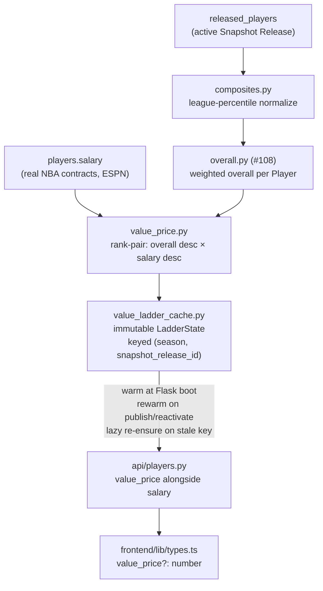

# Walkthrough — #109: the rank-pair price ladder

> Issue: [#109 Rank-pair price ladder → `value_price`](https://github.com/chrooks/Cornerstone/issues/109)
> Commit: `056a375` on `feat/value-economy` · Core: `backend/services/cohesion_engine/value_price.py`, `backend/services/snapshot_versions/value_ladder_cache.py`

## The idea in one sentence

The NBA's own pay distribution is the price curve: sort every active Player by `overall` descending, sort the league's real salaries descending, pair by rank — the best skillset earns the biggest real paycheck, the 200th-best earns the 200th salary. No hand-built curve, no knob to tune, and prices stay in dollars people recognize.

## Architecture

Reads released data only, paginated; a cache failure degrades to `value_price: null`, never a broken player read.

## The Legend band — decided from measurement, not taste

36 released Legends span overall **67.3–90.3**; 401 actives span **23.7–76.6**. Eighteen Legends out-score the *best* active (SGA), so a naive merged pool would hand Legends the entire top of the salary curve and deflate every real Player. Instead:

- **Actives rank-pair only against active salaries** — their ladder stays unpolluted.
- **Legends stack above the top real salary** ($59.6M), ordered by overall, spaced by the real distribution's own top-decile marginal dollars-per-rank (~$572K/rank) — even the Legend band's *shape* is inherited from NBA money.
- Result: **Shaq $60.2M → LeBron $80.2M.** A supermax-plus band that still reads as NBA money. Invariant: every Legend prices above every active.

The alternative (a separate hand-tuned Legend tier) reduces to this plus a constant nobody needs yet. Known, accepted consequence: a top active can out-skill a weak Legend yet price below him — inherent to Legends-as-premium-class either way.

## The headline rows

| Player | overall rank | value_price | real salary | story |
|---|---|---|---|---|
| SGA | 1 | $59.6M | $38.3M | best skillset, biggest check |
| **Wembanyama** | 2 | **$55.2M** | **$13.4M** | the exploit this epic exists to close |
| Paul George | 40 | $37.1M | $51.7M | the mirror problem — rosterable again at a fair price |

Monotonicity holds across all 401 actives (property test + live check): higher `overall` never prices lower.

## Code shape

The ladder itself is a pure function — ranks in, dollars out, tie-safe — with the orchestration kept thin:

    # value_price.py (essence)
    actives_by_overall = sorted(actives, key=lambda p: p.overall, reverse=True)
    salaries_desc      = sorted((p.salary for p in actives if p.salary), reverse=True)
    ladder = {p.player_id: salaries_desc[rank] for rank, p in enumerate(actives_by_overall)}
    # legends: top_active_salary + (legend_rank_from_bottom * top_decile_step)

Served in `api/players.py` right next to `salary`, so every existing salary consumer keeps working; the builder flips between them in [#110](https://github.com/chrooks/Cornerstone/issues/110).

## The deliberate stop — 3&D dollars (#119 input)

The taxonomy can't see 3&D role value, and the ladder inherits that blindness. Measured, not hand-waved:

| player | rank | overall | value_price | real |
|---|---|---|---|---|
| OG Anunoby | 74/401 | 59.6 | $25.0M | $39.6M |
| Mikal Bridges | 91/401 | 58.3 | $19.4M | $24.9M |
| Dorian Finney-Smith | 392/401 | 29.8 | **$0.71M** | $12.7M |

No adjustment was built here — that design is a human conversation ([#119](https://github.com/chrooks/Cornerstone/issues/119)), happening before anything ships on top of these prices.

## Tests

8 unit (ladder mechanics, monotonicity property, flat-top edge, mismatched-pool guard) + 3 integration (both fields on bulk + profile reads, null when unranked) + 2 updated publish/reactivate rewarm tests. Full suite **973 passed / 4 known-red** (#116 baseline).

## TLDR

Skill rank buys you the league's real paycheck at that rank. Legends extend the same curve past the top of it. Wemby costs supermax money now, Paul George is playable, and the one thing the ladder still can't price — 3&D role value — is measured in dollars and parked for a human design call.
