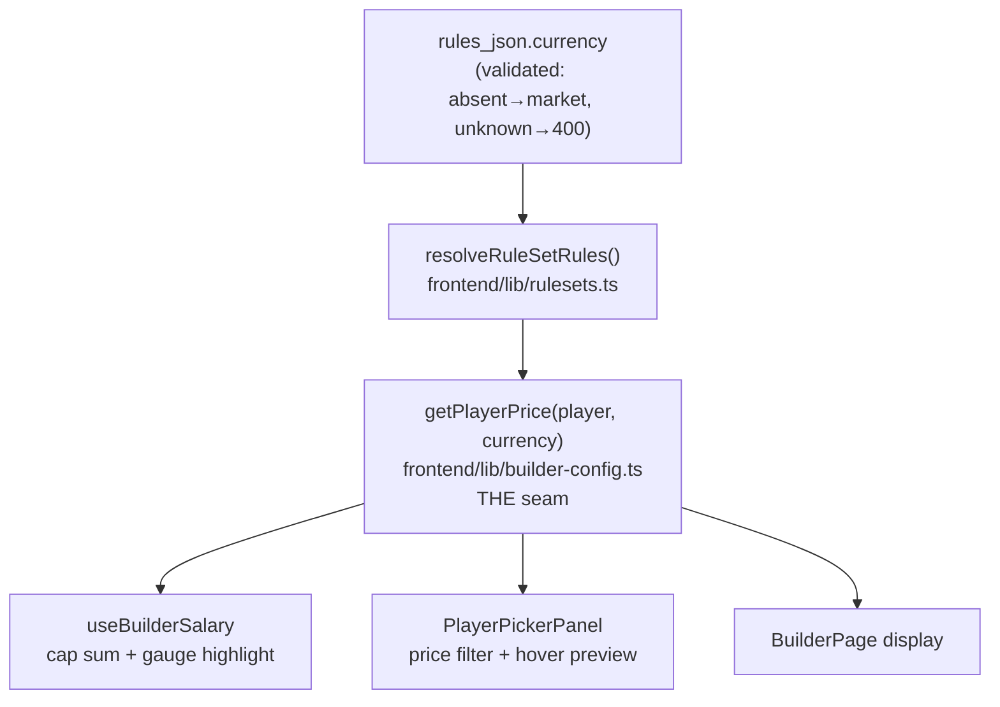

# Walkthrough — #110: the RuleSet currency flag

> Issue: [#110 RuleSet `currency` flag, builder consumes it](https://github.com/chrooks/Cornerstone/issues/110)
> Commit: `2044999` on `feat/value-economy` · Seam: `frontend/lib/builder-config.ts` + `backend/api/rulesets.py`

## What this slice is

The switch, not the flip. A RuleSet can now declare which money it plays with — `rules_json.currency: "market" | "value"` — and the builder prices every Player through that declaration. No existing RuleSet changes; they all default to `market` and stay byte-for-byte identical. [#111](https://github.com/chrooks/Cornerstone/issues/111) throws the switch for `standard`.

## The seam

Both currencies are dollars, so nothing about the gauge, cap, or filters needed new units — they just needed **one place** that answers "what does this Player cost here?":



```ts
// builder-config.ts (essence)
export function getPlayerPrice(player: PlayerWithSkills, currency: RuleSetCurrency): number | null {
  return currency === "value" ? player.value_price ?? null : player.salary ?? null;
}
```

A null `value_price` behaves exactly like a null `salary` does today (`?? 0` in the cap sum, null-guard in the picker filter) — no new "unpriceable" semantics invented.

## The discovery worth remembering

`POST /builder/evaluate` has **no salary math at all** — cap enforcement lives entirely in the frontend. So the backend's whole job here is validating and serving the flag (`_normalize_rules_json` in `api/rulesets.py`); the pricing Boundary is the frontend seam. Anyone later adding server-side cap enforcement should start from `getPlayerPrice`'s contract.

## Proof

- 3 new validation tests (default-market, accepts-value, rejects-unknown) — `test_rulesets_api.py`, 24 green.
- A `value`-currency RuleSet validates + persists end-to-end via fixtures; `/evaluate` stays green (it's currency-agnostic).
- Full suite **978 passed / 4 known-red** ([#116](https://github.com/chrooks/Cornerstone/issues/116) baseline); `npm run lint` clean.

## TLDR

One validated flag on the RuleSet, one `getPlayerPrice` seam in the builder, every price-reading surface routed through it. Existing RuleSets untouched. The flip itself is #111's payoff slice — gated on the #119 design conversation.
