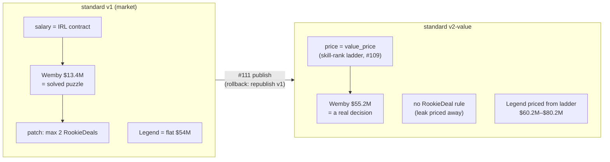

# Walkthrough — #111: flipping `standard` to the value economy

> Issue: [#111 Flip `standard` to value currency; retire the rookie-scale rule](https://github.com/chrooks/Cornerstone/issues/111)
> Commit: `9d13fb2` on `feat/value-economy` · Epic payoff slice — closes [#107](https://github.com/chrooks/Cornerstone/issues/107)

## What flipped

This is the slice where the epic becomes user-visible. Three deletions-by-design:

1. **`standard` republished on `currency: "value"`** — version `c986fe12` (v2-value). Rollback is one action: republish prior version `852940ad`. Saved Teams pin their RuleSet version, so nothing anyone saved changes price.
2. **The 2-RookieDeal limit is gone** — from `rules_json`, validation, and every builder Surface (counter, badge, enforcement). It only ever existed to patch the Wemby leak; with the leak priced away, the patch is dead code. The `is_rookie_deal` *data* field survives — only the constraint died.
3. **The flat $54M legend salary is gone** — the Cornerstone Legend now flows through the same `getPlayerPrice` seam as everyone else, at ladder prices ($60.2M–$80.2M).

Cap math held without retuning: cheapest legal Build is $64.9M against the $195M SalaryCap — every Legend affordable, none trivial.

## The proof: a synthetic meta

No users exist yet, so the concentration measurement generates its own meta. `backend/scripts/concentration_harness.py` plays the min-maxer:

- **120 deterministic random-restart searches** (seed 0) over the PlayerPool under `standard`'s constraints — 9 slots, one Legend Cornerstone, cap at value prices.
- Hill-climbing steps score cheaply (starting-Lineup cohesion, ~1.9ms, cached); the top 250 candidates get the full deterministic `evaluate_roster` ranking. 146s total, no Claude, no NBA.com.
- Top 50 distinct Rosters → per-Player appearance fraction. That fraction is **concentration**.

## The verdict

| signal | result |
|---|---|
| Max active-slot appearance | **26% — Wembanyama at $55.2M** (pre-epic: ~100% at $13.4M) |
| Threshold X (chosen) | 40% for active slots — nobody close |
| #119 3&D tripwire | **did not fire** — OG 4%, Bridges 2%, Finney-Smith 2% |
| Formerly-overpaid check | Paul George appears at 4% at $37.1M — rosterable, not dominant |

The over-represented actives are cheap rim-protecting bigs (Porzingis 24%, Gobert 18%, Okongwu 14%) — a meta *lean*, not a solved puzzle, and the top-50 rosters genuinely disagree about who to buy. **The economy works.**

One structural note flagged rather than buried: **LeBron holds the mandatory-Legend slot in 72% of top rosters** despite carrying the highest price ($80.2M). That's concentration on a slot one of 36 Legends *must* fill — a legend-slot diversity question for a future conversation, not an active-economy leak.

## The lasting artifact

The harness is a reusable **exploit finder**: point it at any future pricing state (retune, new season salaries, a #119 correction) and it reports who the meta would collapse onto — before any user finds the leak. Today it would have said "Wemby, 96%, $13.4M." Now it says "nobody in particular."

## Tests

977 passed / 4 known-red ([#116](https://github.com/chrooks/Cornerstone/issues/116) baseline); lint clean. One test deleted with its rule (`test_save_team_rejects_too_many_rookie_deals`); `test_rookie_deal.py` kept because it tests data derivation, not the dead constraint. Stragglers (legacy `/rosters` $54M stamp, stale Playwright cap constant) filed as [#123](https://github.com/chrooks/Cornerstone/issues/123).

## TLDR

standard now plays with honest money: skill sets price, rookie patch deleted, Legends on the ladder. Synthetic meta proves it — Wemby 100%→26%, no player over 40%, 3&D tripwire silent. Exploit finder stays in the toolbox. Epic #107 closed.
