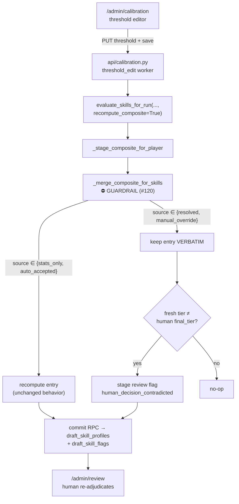
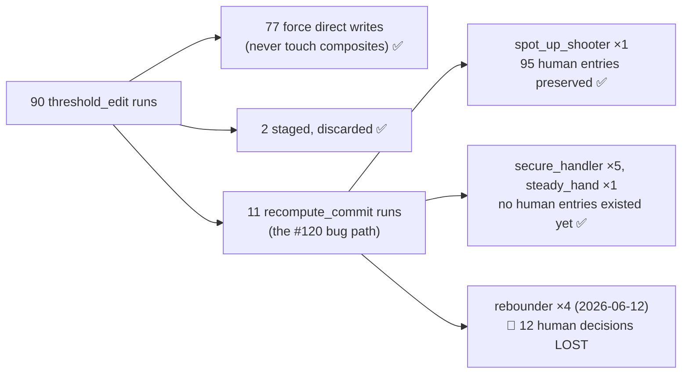

# Walkthrough — #120: the recompute guardrail

> Issue: [#120 `recompute_composite` silently destroys 5,227 human review decisions](https://github.com/chrooks/Cornerstone/issues/120)
> Commit: `7427c27` on `feat/value-economy` · Files: `backend/services/skill_engine/evaluation_only.py`, `backend/tests/test_threshold_edit_composite_recompute.py`

## Why this mattered

The skill pipeline stores, for every player and skill, a composite entry whose `source` records **who decided it**:

| source | meaning | count at fix time |
|---|---|---|
| `stats_only` | the stat engine alone | 2,534 |
| `auto_accepted` | stat engine and Claude agreed | 1,026 |
| `resolved` | **a human resolved a review flag** | **4,691** |
| `manual_override` | **a human overrode the engine** | **536** |

Those last two rows — 5,227 entries — are the majority of the curated value in the dataset.
Every threshold retune runs `evaluate_skills_for_run(..., recompute_composite=True)`, and until this fix that path rebuilt every affected entry from fresh stat tiers **without ever reading `source`**.
Concretely: Wembanyama's `rim_protector` is a `manual_override` of All-Time Great over a stat tier of Elite. A recompute handed back Proficient — the engine forgetting what it was told.
It hadn't bitten only because the single recompute run shipped so far (#113, `steady_hand`) touched a skill that happened to be 100% `stats_only`.

## Where the guardrail sits

One function is the chokepoint every caller routes through, so the guardrail lives there and nowhere else:



The ordinary pipeline path (`recompute_composite=False`) was never dangerous — it stages `source='stats'` rows and leaves composites alone. Only this retune path needed the gate.

## The mechanics

A frozen set names the protected sources once:

```python
# Composite entries whose `source` records a human review decision (issue #120).
_HUMAN_DECISION_SOURCES = frozenset({"resolved", "manual_override"})
```

Inside `_merge_composite_for_skills`, the recompute **still runs** for protected entries — not to write, but to compare. Disagreement raises a review flag; agreement is a no-op:

```python
if existing_entry.get("source") in _HUMAN_DECISION_SOURCES:
    # Human decision — keep the entry verbatim. Flag only when the fresh
    # recompute disagrees with the human's final_tier (agreement = no-op).
    merged[skill_name] = existing_entry
    human_tier = existing_entry.get("final_tier")
    fresh_tier = recomputed.get("final_tier")
    if _tier_index(fresh_tier) != _tier_index(human_tier):
        protected_flags.append(StagedFlagRow(
            player_id=player_id,
            skill_name=skill_name,
            flag_reason=(f"human_decision_contradicted:"
                         f"{existing_entry.get('source')}:{human_tier}"),
            season=season,
            claude_tier=existing_entry.get("claude_tier"),
            stats_tier=fresh_tier,
        ))
    continue
```

This is the **re-flag** option from the issue — chosen over preserve-outright (hides real contradictions) and refuse-the-run (blocks legitimate retunes). A threshold change *should* prompt a fresh look at a human ruling; it should just never erase it silently. The review queue is the designed surface for exactly that disagreement.

Two plumbing details worth knowing:

- `_merge_composite_for_skills` now returns `(merged, protected_flags)`, and `_stage_composite_for_player` seeds its flag list from the protected flags, then **skips human-source skills** in its existing flagged-entry loop — so one player+skill never carries two flags from one run.
- The commit RPC dedupes flags on `(skill_profile_id, skill_name)` via delete-then-insert, so re-committing a run doesn't stack duplicate open flags.

The flag's `flag_reason` is self-describing in the review queue: `human_decision_contradicted:manual_override:All-Time Great` with `stats_tier` carrying what the retune would have said.

## Proof

Written test-first; the three behavior tests were run against the pre-fix code and failed exactly as expected (preserve tests saw the entry overwritten; the flag test saw zero staged flags), then went green after:

- `test_manual_override_survives_threshold_retune` — the named regression test from the AC
- `test_resolved_entry_survives_recompute`
- `test_recompute_flags_when_it_contradicts_human_decision`
- plus guard tests locking the agreement-no-flag and non-human-recompute paths

Full suite: **964 passed, 4 failed** — the 4 are the pre-existing known-red baseline tracked in [#116](https://github.com/chrooks/Cornerstone/issues/116), untouched by this change.

## The audit (AC 4)

The issue asked whether any *published* Snapshot Release had already lost human decisions this way. The expected answer was no — #113's `steady_hand` run was believed to be the only recompute ever committed, and that skill carried no human decisions. **The expected answer was wrong.**

`backend/scripts/audit_recompute_losses.py` (read-only, fully paginated) classified all 90 `threshold_edit` pipeline runs by write path:



Because the flag audit-trail table was empty system-wide, the audit diffed each touched skill's frozen `released_players` snapshots between consecutive releases instead. The four `rebounder` runs behind the **"Defensive Rebounding Update"** release reverted 12 `manual_override`/`resolved` entries to `stats_only` — six with real tier drops (Kenrich Williams Capable→None, Steven Adams Elite→Capable, Stephen Curry Capable→None, three Proficient→Capable) — and every subsequent release carried the loss forward, **including the current active one**. Remediation (restore the 12 in the draft, let the now-guarded recompute re-flag genuine contradictions) is tracked in its own follow-up issue.

So the guardrail wasn't hypothetical protection: the exact failure it prevents had already shipped once, silently, and nobody noticed for a month.

## TLDR

Retune recompute used to overwrite everyone's homework. Now: engine entries recompute as before; human entries are kept verbatim, and if the fresh math disagrees with the human, the disagreement becomes a review flag instead of an overwrite. One chokepoint function, one frozenset, no new knobs.
