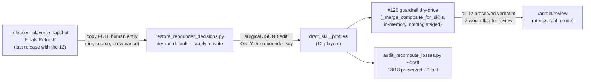

# Walkthrough — #121: restoring the 12 destroyed rebounder decisions

> Issue: [#121 Restore the 12 human decisions destroyed by the rebounder recompute](https://github.com/chrooks/Cornerstone/issues/121)
> Commit: `786f1a6` on `feat/value-economy` · Files: `backend/scripts/restore_rebounder_decisions.py`, `backend/scripts/audit_recompute_losses.py` (`--draft` mode)

## Why this existed

[#120's audit](./120-recompute-guardrail.md) proved the recompute bug wasn't hypothetical: four `rebounder` threshold-retune runs (2026-06-12) overwrote 12 human-decided entries, the "Defensive Rebounding Update" release shipped the damage, and every later release carried it forward. This issue put the humans' calls back — **in the draft only**. The live release stays as-is until the next deliberate publish; that's the release model working as designed, not a gap.

## The data flow

## What was restored

| Player | draft before | restored to |
|---|---|---|
| Kenrich Williams | None (stats_only) | **Capable (resolved)** |
| Steven Adams | Capable (stats_only) | **Elite (resolved)** |
| Stephen Curry | None (stats_only) | **Capable (manual_override)** |
| Evan Mobley | Capable (stats_only) | **Proficient (manual_override)** |
| Luke Kornet | Capable (stats_only) | **Proficient (manual_override)** |
| Joel Embiid | Capable (stats_only) | **Proficient (manual_override)** |
| Jayson Tatum | Elite (stats_only) | **Proficient (manual_override)** |
| Josh Hart, Jalen Smith, Kevin Love, Russell Westbrook, Jalen Johnson | same tier, wrong source | source restored (`manual_override`) |

Tatum's row is worth a beat: the human decision was *lower* than the stat tier — the override had marked him **down**. Restoration isn't about inflating anyone; it's about the recorded human ruling being the ruling.

## The discipline

The script is the reusable pattern for this class of repair:

- **Dry-run by default**, `--apply` to write, full before/after diff printed as the backup record.
- **Surgical write**: replaces only the `rebounder` key inside the composite JSONB, with an in-script assertion that no other key changed, then verifies by re-read.
- **Idempotent**: a second dry-run reports all 12 as NO-OP.
- **Guarded-recompute evidence** without touching the pipeline: drives `_merge_composite_for_skills` in-memory against real current thresholds. All 12 survive byte-identical; 7 would raise `human_decision_contradicted` flags (Mobley, Kenrich, Adams, Curry, Tatum, Kornet, Embiid) because today's thresholds genuinely disagree — which is exactly the #120 contract: the disagreement goes to the review queue, the decision doesn't vanish.

## The bonus finding

Running the audit in its new `--draft` mode across all skills surfaced **one more pre-existing loss outside this issue's scope**: LeBron James, `spot_up_shooter`, `manual_override: Capable` → `stats_only: None`, from a different pre-guardrail run. Filed as [#122](https://github.com/chrooks/Cornerstone/issues/122) and restored by the same pattern.

## TLDR

Copied the 12 human rulings back from the last release that had them, wrote only those 12 JSONB keys, proved the write surgical + idempotent, proved the new guardrail keeps them, and re-audited to zero losses. One stray loss (LeBron) found on the way → #122.
