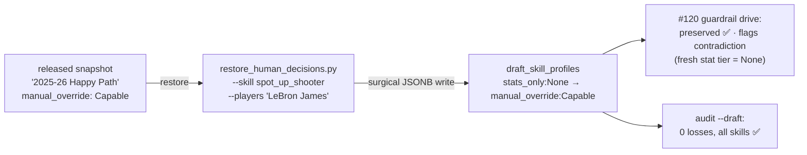

# Walkthrough — #122: LeBron's spot_up_shooter restore

> Issue: [#122 LeBron's spot_up_shooter manual_override lost in the current draft](https://github.com/chrooks/Cornerstone/issues/122)
> Commit: `80c0a49` on `feat/value-economy` · File: `backend/scripts/restore_human_decisions.py` (generalized from the #121 script)

## The one-entry story

[#121's](./121-rebounder-restoration.md) full-draft audit sweep caught a second pre-guardrail casualty beyond the rebounder twelve: LeBron James' `spot_up_shooter` had been human-ruled **`manual_override: Capable`**, and a different pre-#120 pipeline run (`7be8be31…`) had reverted the draft entry to **`stats_only: None`**. Unremediated, the next Snapshot Release publish would have shipped the loss.

Same discipline as #121: dry-run diff first, `--apply` with a no-other-key-changed assertion, re-read verification, NO-OP on the second dry-run. The guardrail drive shows the restored entry survives a recompute and *would* raise `human_decision_contradicted:manual_override:Capable` — today's stats genuinely say None, and that disagreement now belongs to the review queue instead of silently winning.

## The lasting artifact

The rebounder-specific script became **`restore_human_decisions.py`** with `--skill`/`--players` arguments. The next loss of this class — if one ever slips past the guardrail — is a one-liner to repair instead of a new script.

## TLDR

Last known pre-guardrail loss found and fixed. `audit --draft` verdict: **zero unremediated losses in the current draft, all skills.** The curated dataset is whole again, and the tooling to keep it that way is generic now.
