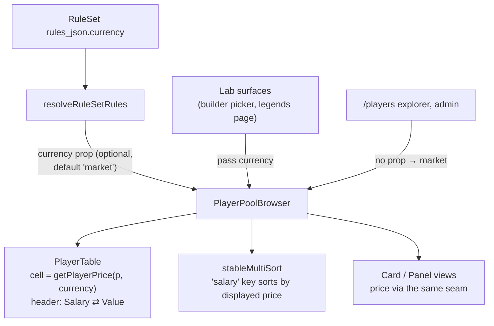

# Walkthrough — #124: showing the prices the cap actually charges

> Issue: [#124 Lab pickers must show effective prices under a value-currency RuleSet](https://github.com/chrooks/Cornerstone/issues/124)
> Commit: `569cc0e` on `feat/value-economy` · Frontend-only

## The gap

After the [#111 flip](./111-standard-value-flip.md), the builder *charged* value prices (cap, gauge, availability all route through `getPlayerPrice`) but *displayed* IRL contracts — the shared player table's Salary column read `player.salary` raw. And the Legends picker showed no price at all, right when Legends started costing $60.2M–$80.2M of a $195M cap. The math was honest; the Signifiers weren't.

## The fix — one prop, one seam, no forks

- Lab surfaces pass the resolved currency; everything else passes nothing and stays pixel-identical (`getPlayerPrice(p, 'market') === p.salary`, same formatters).
- The sort pipeline orders by the displayed price, so what you see is what ranks.
- The Legends picker enriches its Legend rows with `value_price` from the bulk read and shows the price in the Row column and Panel scouting facts. The stale flat-$54M legend `salary` stamp is deliberately never rendered.

## The environment lesson (why this looked so much worse than it was)

Chris's report bundled three things, and only one was a code bug:

| symptom | cause |
|---|---|
| $0 cap bar, free LeBron, real salaries everywhere | **dev box** runs `develop` + its own DB — the value economy (code *and* the RuleSet flip) had never reached it |
| local backend serving no `value_price` | **stale Flask process** predating #109 — restarted |
| picker column showing real salary on the branch | the actual #124 bug |

Worth keeping: `next dev` hot-serves the working tree, but a long-lived Flask process serves whatever code it was started with — after landing backend work, restart the Flask dev server before judging behavior.

## TLDR

Display now goes through the same `getPlayerPrice` seam the cap uses: one optional currency prop on the shared browser, header flips Salary⇄Value, sort follows the shown number, Legends picker shows what a Cornerstone costs. Market surfaces untouched.
