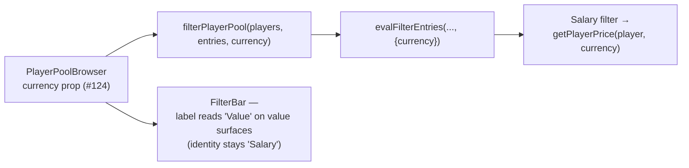

# Walkthrough — #125: the filter follows the price; the RD tag retires

> Issue: [#125 Picker: salary filter ignores value currency; RD tag is a dead signifier](https://github.com/chrooks/Cornerstone/issues/125)
> Commit: `1664ab5` on `feat/value-economy` · Frontend-only, follow-up to [#124](./124-picker-price-display.md)

## What was wrong

Two stragglers surfaced the moment Chris used the live value picker:

1. **The Salary filter judged a number the user can't see.** Its predicate read raw `player.salary` while the column displays (and sorts, and charges) the effective price — so under `standard`, "Salary ≤ 54.2" excluded on IRL contracts and left visibly contradicting rows.
2. **The RD (RookieDeal) tag outlived its meaning.** It existed to help players respect the 2-RookieDeal builder constraint; [#111](./111-standard-value-flip.md) deleted that rule, leaving the tag rendering next to value prices it has no relationship with — a dead Signifier.

## The fix

Filters gain an ambient `FilterContext` — one optional argument, threaded from the same `currency` prop #124 added to `PlayerPoolBrowser`:

```ts
// playerFilters.ts — the Salary filter now matches what the surface shows
apply: (player, value, ctx) => {
  const [op, raw] = value.split("|");
  const n = parseFloat(raw) * 1_000_000;
  const price = getPlayerPrice(player, ctx?.currency ?? DEFAULT_CURRENCY);
  return !isNaN(n) && price != null && applyNumericOp(price, op, n);
},
```



The visible label follows the column header — dropdown and filter pill read **Value** under value currency — while the filter's identity key stays `Salary`, so nothing else (dedup, selection state) moves. The RD tag is deleted from the Row, Card, and Panel price renders; the `is_rookie_deal` data field survives for anything that still wants the fact.

Display, sort, cap math, and now filtering all resolve through the single `getPlayerPrice` seam. There are no remaining price consumers outside it.

## TLDR

Filter now judges the same dollars the column shows, and says so in its label. RD tag deleted — the rule it signified died in #111. Every price read in the app now flows through one seam.
