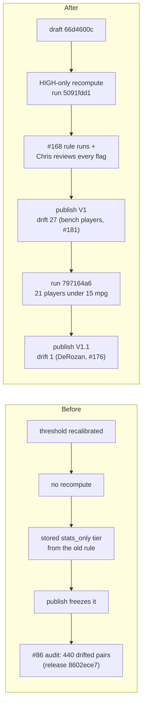

# Walkthrough — #130: stale stats tiers recomputed and republished

> Issue: [#130 Recompute drifted skill tiers surfaced by the #86 audit (440 pairs) and republish](https://github.com/chrooks/Cornerstone/issues/130)
> Commits: `fd16be3` (id lists in groups of 100, drift audit paged) · `470481b` (`recompute_composite` passthrough, a filtered stats run merges) on `develop`. The data fix itself is pipeline runs, not commits: `5091fdd1` in draft `66d4600c` (release "2025-26 V1"), and `797164a6` in draft `020cbc9e` (release "2025-26 V1.1").
> Found by the [#86](https://github.com/chrooks/Cornerstone/issues/86) tier-drift audit: 440 (player, Skill) pairs in release `8602ece7` held a stats-only tier that today's rule and stats no longer give. Run inside the #119 ExecPlan (M1.1, M2, M5).

## The problem in one picture

A stats-only tier is recomputed only when a run touches that player and Skill. A threshold change with no recompute leaves the old tier in place, and every later publish freezes it again.



## The fix

### 1. Scope: the 7 HIGH Skills, not the full pool

Only the 7 HIGH-confidence Skills carry `stats_only` tiers (`HIGH_CONFIDENCE_SKILLS` in `backend/services/skills.py`). A full-pool recompute would also re-run the LOW Skills and stage about 2,534 flags, because today's LOW stat rules score far below the reviewed tiers. So the recompute ran with `skill_filter` set to the 7 HIGH Skills (re-scope comment on #130, 2026-09-21).

### 2. The run can recompute a named set of Skills — `backend/api/pipeline.py`

```python
if (recompute_composite or with_claude) and not skill_filter:
    return _err(
        "skill_filter_required — a composite recompute or Claude run must name its Skills",
        400,
    )
```

`recompute_composite` stages the merged composite, so the #120 guard keeps every human call verbatim and flags a contradiction. A filtered stats run no longer wipes the Skills it did not evaluate (`backend/services/skill_engine/evaluation_only.py`):

```python
# A filtered stats run stages a whole row, and commit replaces it — so merge
# the filtered result into what the player already has, or the skills this
# run did not evaluate would be wiped.
```

### 3. Every id list goes out in groups of 100 — `backend/services/supabase_client.py`

The dev gateway returns HTTP 414 above about 220 UUIDs in one query. The review queue, the run diff, the publish check and the drift audit each sent about 400.

```python
def in_chunks(ids: Sequence[T], size: int = 100) -> list[list[T]]:
    return [list(ids[i : i + size]) for i in range(0, len(ids), size)]
```

`backend/scripts/audit_tier_drift.py` now pages the composite player ids (1,000 per page) and passes them in, so `find_tier_drift` reads in groups of 100. This closes the issue's first follow-up.

### 4. The runs

| Run | Draft | What it did |
|---|---|---|
| `b3211b7a` | `66d4600c` | Steady Hand rule re-staged without the blanket flag: 149 tier moves, 8 flags instead of 351 |
| `5091fdd1` | `66d4600c` | HIGH-only recompute: 312 composite tier moves on 214 players, 261 flags (150 contradict a human call) |
| 7 rule runs (#168) | `66d4600c` | A new or floored rule on each of the 7 HIGH Skills, each flag set reviewed after its rule landed |
| `797164a6` | `020cbc9e` | The 21 players under 15 mpg on 4 Skills: 28 tier moves, 0 human entries changed |

Chris reviewed every flag (M5.10: 0 open) and published "2025-26 V1 (#119 #130 #134 #152 #168)" on 2026-09-25 at 16:05Z.

### 5. The first publish still drifted: 27 tiers

`audit_tier_drift.py` found 27 drifted tiers across 22 players right after V1. 21 of the 22 play under 15 minutes a game. Runs rate players at 15+ mpg (`DEFAULT_MIN_MPG`), but the publish freezes every player of the season. So the bench players kept tiers from the old rules. Filed as [#181 Rule changes skip published players under 15 mpg](https://github.com/chrooks/Cornerstone/issues/181).

On Chris's "fix it", run `797164a6` re-rated the 21 bench players on the 4 drifted Skills in a new draft. Chris resolved its 5 Spot Up flags (3 data missing, 2 contradictions, 16:22Z) and published "2025-26 V1.1 (#181 drift fix)" at 16:28Z.

The 22nd player is DeMar DeRozan: stored Spot Up None, recompute Capable through the Movement Shooter auto-promotion. The lift misfires for him, and Chris ruled None correct. It is noted on [#176 threshold-edit runs skip auto-promotions](https://github.com/chrooks/Cornerstone/issues/176).

## Decision: the audit keeps mixing "stale" with "stats moved"

The audit compares against the latest stats. So it cannot tell a stale tier from a tier the stats moved since publish. Default c.14 of the #119 plan accepts this as fine for an ops tool, and Chris approved all defaults at M0.1 (2026-09-21). Telling them apart needs per-release stat provenance, which nothing else needs today.

## Proof

Re-verified read-only on the dev database on 2026-09-25, after the V1.1 publish:

| Check | Result |
|---|---|
| Drift, #86 audit on release `8602ece7` | 440 pairs |
| Drift after V1 (`66d4600c`) | 27 tiers, 22 players |
| `python scripts/audit_tier_drift.py --season 2025-26` after V1.1 | **1** tier, 1 player (DeRozan Spot Up, ruled correct) of 2,497 `stats_only` entries on 401 composites |
| Publish-time drift log, V1.1 (backend log, 16:28:27Z) | `1 stale stats-derived tier(s): DeMar DeRozan/spot_up_shooter:None->Capable` |
| `python scripts/dev_checks.py damage` | **0** (of 45 resolved-None HIGH entries) |
| `python scripts/dev_checks.py release` | V1.1 `020cbc9e` active; 437 rows (401 actives, 36 Legends), all with `point_of_attack_defender` and `off_ball_disruptor` |
| `python scripts/dev_checks.py draft` | no open draft; 0 open flags; `validate_publishable` all zeros |
| `python -m pytest tests/test_in_chunks.py` | 11 passed (includes `test_drift_audit_fetch_helpers_chunk`, 401 fake ids) |

The audit sent 401 composite ids in groups of 100 with no 414. `backend/.env` points at the local dev gateway, not the cloud project, which closes the second follow-up.

## Found along the way

- The rated pool (15+ mpg) and the published pool differ. The release is fixed; the lasting fix ("rate every published player" or "re-rate the unrated on a rule change") stays open on #181.
- The HIGH-only recompute first staged 351 blanket Steady Hand flags (`always_flag_for_review` on a high-confidence Skill). Chris dropped the blanket flag, and the re-run staged 8.
- The publish-time drift report lives only in the publish response and a log line. The V1 line was lost when the backend restarted at 16:09Z, so the 27 comes from the M5.15 audit run. [#131](https://github.com/chrooks/Cornerstone/issues/131) surfaces the report in the admin publish flow.
- `drift_audit._fetch_latest_stats` does not page yet (about 310 rows per 100-id chunk on dev). A `ponytail:` comment in `in_chunks` names the ceiling.

## TLDR

Every published stats-only tier now matches today's rules and stats, except one Chris ruled correct. The drift audit went from 440 to 1, and the dev gateway no longer rejects it.
