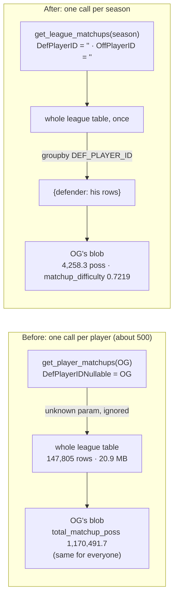

# Walkthrough — #134: each defender gets his own matchups

> Issue: [#134 Matchup fetch sends the wrong param names — every player's matchup_defense is the league total](https://github.com/chrooks/Cornerstone/issues/134)
> Commits: `6ea91de` (one league matchup call, G/F/C buckets, `matchup_difficulty` and `handler_share`) · `ab62767` (the read-only simulation and `dev_checks.py` that drafted and checked the new rule) on `develop`. The `versatile_defender` rule is JSONB, not code: it went in through the calibration endpoint as run `440046d8` in draft `66d4600c` (release "2025-26 V1").
> Found by the #119 grill-prep research: on 2026-09-21 a live probe for OG Anunoby returned the whole league's matchup table, and every active's dev blob held the same total, 1,170,491.7 possessions.

## The bug in one picture

The fetch asked NBA.com for one defender's matchups with a parameter name the endpoint does not know. NBA.com ignored it and sent the whole league. Every player's blob stored the same league totals.



Two more defects sat behind the first one:

- **The position buckets were wrong.** PlayerIndex gives G, F, C, GF and FC. The old `_map_position` mapped G to SG, so the PG and PF buckets were always 0. It had no key for GF or FC, so 98 of 582 defenders fell out of every bucket but still counted in the total.
- **The `versatile_defender` Elite gate could never fire.** It asked for 4 or more position groups guarded. With three buckets, 3 is the ceiling. No player ever reached Elite on stats.

## The fix

### 1. One league call, grouped by defender — `backend/services/nba_api_client.py`

The real parameter names are `DefPlayerID` and `OffPlayerID`. Blank means "all", which is what a league-wide call wants:

```python
params = {
    "Season":      season,
    "SeasonType":  "Regular Season",
    "LeagueID":    "00",
    "PerMode":     "Totals",
    "DefPlayerID": "",
    "OffPlayerID": "",
}
...
df = pd.DataFrame(rs["rowSet"], columns=rs["headers"])
return {int(k): g for k, g in df.groupby("DEF_PLAYER_ID")}
```

`get_bulk_stats` carries the result as `data["matchups"]`, beside the 28 other league frames. The per-player fetch reads its rows from there:

```python
matchup_df    = bulk_data.get("matchups", {}).get(nba_api_id)
```

`get_player_matchups` and the per-opponent `CommonPlayerInfo` lookup are deleted. The old code downloaded the same 20.9 MB table once per player, and some players timed out.

### 2. A failed call cannot write an empty blob

A fetch writes a fresh `fetched_at`, and the 7-day skip then keeps that row. So a failed matchup call must not persist a null `matchup_defense`:

- `backend/api/pipeline.py`: the Stat Fetch job checks the league call once before its loop. If the call failed, the run stops with "LeagueSeasonMatchups failed; retry in 10 minutes".
- `backend/services/players_service.py`: a single fetch returns without a write while `matchups` is empty.
- `nba_api_client.py`: a failed call still caches the other 28 frames. The next request retries only the matchup call, at most once per 10 minutes.

### 3. G/F/C buckets through an explicit map — `backend/services/stats_assembler.py`

```python
POSITIONS = ["G", "F", "C"]

_MATCHUP_GROUPS = {
    "PG": "G", "G": "G", "SG": "G", "GF": "G",
    "SF": "F", "F": "F", "PF": "F", "FC": "F",
    "C": "C",
}
```

A raw dashed dual ("F-G", "C-F") goes to its first letter, because PlayerIndex lists the primary position first. The blob keys are now `matchup_poss_at_g/f/c` and `matchup_fg_pct_at_g/f/c`. Group FG% is makes over attempts, so a possession with no shot no longer counts as a miss.

### 4. Two new signals in the blob

- `matchup_difficulty`: the possession-weighted scoring percentile of the players he guarded (opponents with 20 or more games).
- `handler_share`: the share of his possessions spent on players whose PnR ball-handler plus isolation share is 0.40 or more.

The #152 `point_of_attack_defender` rule reads both.

### 5. The `versatile_defender` rule, recalibrated on real data

The issue asked for a recalibration through the calibration API, not SQL. `sim_threshold_candidate.py` drafted it read-only against the refetched blobs. Chris rejected the first cut: its 0.55 cap on guard share sent Derrick White, Mikal Bridges and Ausar Thompson to None. He approved the second cut on 2026-09-22 (plan M1.35):

| Step | Test |
|---|---|
| Sample | 1,000 to 20,000 matchup possessions, and at least 2 groups over 20% |
| Spread | concentration of the G/F/C shares (sum of squares) at or under 0.50 — no cap on any one group |
| Quality | the FG% gap, normalised inside the defender's own possession mix: Elite −1.4, Proficient −0.7, Capable +0.5 |
| Floors | Elite needs 2,000 possessions, Proficient 1,500 |

It keeps `stat_confidence: low` and `always_flag_for_review: true`. For players whose reputation beats one season of numbers (Tatum, Nembhard, Leonard, Herbert Jones), Chris named manual override in review as the correction path, not a looser cut.

Run `440046d8` staged the rule and was committed on 2026-09-23 at 14:26Z, 392 rows. Chris then reviewed every Versatile Defender flag (plan M5.11) before the V1 publish.

## Proof

Re-verified read-only on 2026-09-25 against the dev database (`dev_checks.py` and its read-only client).

| Check | Before | Now |
|---|---|---|
| OG Anunoby `total_matchup_poss` | 1,170,491.7 | **4,258.3** (G 1,581.3 · F 2,222.9 · C 454.1), fetched 2026-09-22 16:07Z |
| OG `matchup_difficulty` / `handler_share` | absent | **0.7219 / 0.1814** |
| OG `cross_group_fg_pct_diff` | −0.0656 (the league's) | **−0.0458** |
| Blobs holding exactly 1,170,491.7 | 284 | **0** (`blob-stats`) |
| Distinct `cross_group_fg_pct_diff` values | 5 | **309**, 0 null |
| Blobs with `matchup_difficulty` | 0 | **359** |
| `tests/test_matchup_defense.py` | — | **35 passed** |

The grouping test (`test_league_matchups_one_call_grouped_by_defender`) asserts one call, blank `DefPlayerID` and `OffPlayerID`, no `*Nullable` key, and each defender's rows under his own id.

**The recompute matches the approved table.** On the 359 players with a refetched blob, today's stats profiles read Elite 18 · Proficient 32 · Capable 136 · None 173. The approved drift table said Elite 18 · Proficient 32 · Capable 136 · None 210, where 210 is 173 plus the 37 stale blobs below.

**The drift was reviewed before the publish.** All 207 Versatile Defender flags carry a resolution (143 Trust Claude, 44 Trust Stats, 20 manual override). Chris resolved them between 2026-09-23 20:46Z and 2026-09-24 22:05Z. V1 published on 2026-09-25 at 16:05Z.

**The release is clean.** Active release "2025-26 V1.1 (#181 drift fix)": 437 rows. All 401 actives carry `versatile_defender` (372 resolved, 29 manual override). 0 open flags, `damage` 0. `audit_tier_drift.py` reports 1 drifted tier, and it is not this Skill: DeMar DeRozan `spot_up_shooter`, the known auto-promotion quirk on #176, where Chris ruled None correct.

Named players in the release: OG Anunoby, Derrick White, Ausar Thompson and Alex Caruso Elite. Mikal Bridges, Herbert Jones and Jayson Tatum Elite by review. Kawhi Leonard Proficient, Andrew Nembhard Capable.

## Found along the way

- **37 players still hold league-total blobs ([#160](https://github.com/chrooks/Cornerstone/issues/160), open).** They play under 15 minutes a game, and the Stat Fetch pool starts at 15.0. Their totals are 1,177,172.0 and 1,212,914.4, not 1,170,491.7. `dev_checks.py` tests equality with that one value, so it passes them. A magnitude check finds all 37: every one is over 20,000 possessions, and the largest real total is 5,668.4. Seven of them keep an old-rule stats tier of Capable (Capela, González, Cain, Bamba, Richards, Reed, Dillingham). Their released tiers are all human decisions (35 resolved, 2 manual override), not auto-accepted stats tiers.
- **The composite `stat_tier` on human entries is stale.** The #120 guard keeps a human entry verbatim, `stat_tier` included. So 180 of 401 Versatile Defender composite entries hold a `stat_tier` that today's stats profile no longer gives. The released entries read Capable 296, close to the pre-#134 value. `dev_checks.py damage` already reads the stats profile for this reason. Parked.
- **Versatile Defender measures results, not ability.** Some of the league's best perimeter stoppers show a positive gap. An outside check (Thinking Basketball, 2026-09-22) also showed the rule has no term for coverage or scheme versatility; that is [#163](https://github.com/chrooks/Cornerstone/issues/163). Review and manual override carry what the stats cannot.

## TLDR

Each defender's blob now holds his own matchups, from one league call per season, bucketed G/F/C. The `versatile_defender` rule was rebuilt on that data, reviewed flag by flag, and published in V1. The 37 bench players outside the fetch pool remain on #160.
