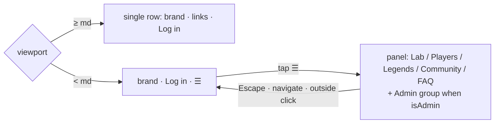

# Walkthrough — #136: the phone navbar

> Issue: [#136 Phone navbar: collapse the top menu behind a button](https://github.com/chrooks/Cornerstone/issues/136)
> Commit: `97d3c94` (2026-09-23) · closed with today's proof, 2026-09-26

## What was wrong

The audit's phone-01 shot measured the top menu at 466 CSS px on a 390 px viewport. It overflowed, and the Profile dialog clipped.

## What changed

Nothing today. The fix shipped on 2026-09-23 in `97d3c94` and the record stayed open. [NavBar.tsx](../../frontend/components/NavBar.tsx) hides `#navbar-links` below `md` and adds `#navbar-menu-btn`, which toggles `#navbar-mobile-panel`: every public link as a full-width row of at least 44 px, an Admin group for admins, Escape closes and returns focus, any navigation closes it. The brand and Log in stay in the bar.

## Proof

[navbar-mobile.spec.ts](../../frontend/tests/navbar-mobile.spec.ts), 4 passed on `https://cornerstone-dev.hestia.chrooks.com`: no sideways scroll at 320 and 390 px, Log in and every link in reach, the desktop row unchanged at 1280 px, and the admin path to the review queue through the menu. Shots: [phone](https://github.com/chrooks/Cornerstone/blob/develop/docs/research/lab-fix-screens-2026-09/136-navbar-phone-after.png), [desktop](https://github.com/chrooks/Cornerstone/blob/develop/docs/research/lab-fix-screens-2026-09/136-navbar-desktop-after.png).
