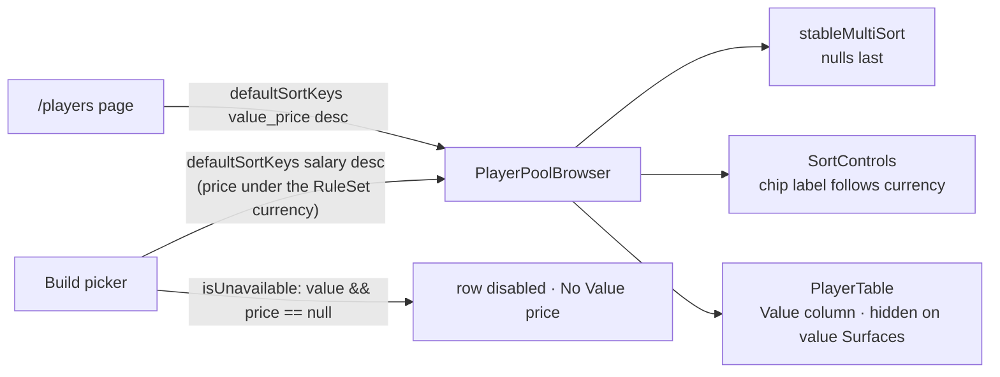

# Walkthrough — #138: the picker opens on Value

> Issue: [#138 Build picker: sort by Value by default and drop the 33 unpriced players](https://github.com/chrooks/Cornerstone/issues/138)
> Commits: `39d8356` (sort, Value column, unpriced label) · `48d28a8` (currency-aware sort chip, Value ahead of Salary) · `develop`
> Proven on dev 2026-09-26 at 1440x900 and 390x844

## What was wrong

The Build picker and `/players` listed players A to Z. The first screen on the standard RuleSet was Adama Bal with a "—" price. Under value currency, 33 active players have no Value price and no skills. They cost $0 and passed the cap check.

## What changed

One sort default in two places, one column, one gate, one label. Chris rolled the `/players` half in on 2026-09-26.



**The sort.** [playerPoolPipeline.ts](../../frontend/components/players/playerPoolPipeline.ts) gains a `value_price` sort field. Its comparator already sends a null value to the end in either direction, so the unpriced sit last without a second rule. The picker sorts by `salary`, which is the price under the active currency, so a market RuleSet sorts by real salary and a value RuleSet by Value.

**The column.** [PlayerTable.tsx](../../frontend/components/players/PlayerTable.tsx) adds `value_price` ahead of `salary`. On a value Surface the salary column already shows Value, so the table drops the duplicate there:

```tsx
const currencyColumns = currency === "value" ? ALL_COLUMNS.filter((c) => c.key !== "value_price") : ALL_COLUMNS;
```

Value leads Salary because a phone shows one price column beside Name and Pos. It must be the number the default sort uses.

**The gate.** [PlayerPickerPanel.tsx](../../frontend/components/builder/PlayerPickerPanel.tsx):

```ts
if (currency === "value" && price == null) return true;
```

Disabled, not dropped. [#117 no-data players](https://github.com/chrooks/Cornerstone/issues/117) still owns what an unrated player means. The row carries `aria-disabled`, and its price cell, card line and panel fact read "No Value price" instead of "—". An Honest Signifier: the row says why it cannot be bought.

**The chip.** The picker sorted by Value but its chip read "Salary". [SortControls.tsx](../../frontend/components/players/SortControls.tsx) now takes the currency and labels the price field the way its column is labelled.

## Proof

[player-sort-logic.spec.ts](../../frontend/tests/player-sort-logic.spec.ts), 3 passed, pins the order and the nulls-last rule. [lab-build-fixes.spec.ts](../../frontend/tests/lab-build-fixes.spec.ts), 4 passed on `https://cornerstone-dev.hestia.chrooks.com`, checks the chip, the first three prices descend, the Value column precedes Salary on `/players`, and Adama Bal's row is disabled with the label.

| | before | after |
|---|---|---|
| picker, desktop | [shot](https://github.com/chrooks/Cornerstone/blob/develop/docs/research/lab-fix-screens-2026-09/138-build-picker-desktop-before.png) | [shot](https://github.com/chrooks/Cornerstone/blob/develop/docs/research/lab-fix-screens-2026-09/138-build-picker-desktop-after.png) |
| /players, phone | [shot](https://github.com/chrooks/Cornerstone/blob/develop/docs/research/lab-fix-screens-2026-09/138-players-phone-before.png) | [shot](https://github.com/chrooks/Cornerstone/blob/develop/docs/research/lab-fix-screens-2026-09/138-players-phone-after.png) |
