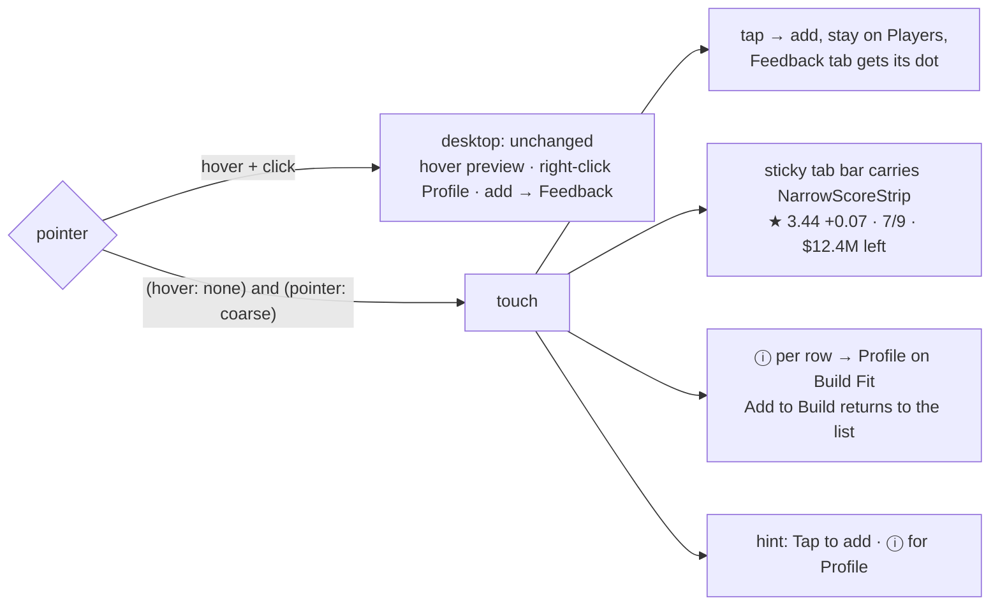

# Walkthrough — #141: the touch picker

> Issue: [#141 Touch picker: add without hover, keep the list, show the score strip](https://github.com/chrooks/Cornerstone/issues/141)
> Commits: `513fbbf` (the feature) · `65d7d82` (Profile opens on Build Fit) · `6f43512` (data-unavailable) · `develop` · proven on dev 2026-09-26

## What was wrong

The picker was built around a mouse. Hover previewed the eval, right-click opened the Profile, and a click added and jumped to the Feedback tab. On a phone none of the first two exist, and the third threw the list away on every add (phone-03, phone-04).

## What changed



**One hook decides.** [useCoarsePointer.ts](../../frontend/lib/hooks/useCoarsePointer.ts) watches `(hover: none) and (pointer: coarse)`. False on the server and the first client render, settled after mount. Viewport width says nothing about pointers; a tablet with a mouse keeps its hover.

**Tap stays.** In [BuilderPage.tsx](../../frontend/components/builder/BuilderPage.tsx) the pick handler branches on the hook:

```ts
if (isCoarsePointer) {
  setFocusedPlayerName(player.name);
  setFeedbackCollapsed(false);
  setHasUnreadFeedback(true);   // the tab's dot, not a jump
  return;
}
handleShowPlayerInFeedback(player);
```

**The strip in the tab bar.** [NarrowScoreStrip.tsx](../../frontend/components/builder/NarrowScoreStrip.tsx) is a one-line reading of the same state the Feedback panel uses: star and signed delta (or "N of 5 starters" below five, as #149 decided), filled/max slots, and cap left or over. It sits inside the sticky `#builder-narrow-workspace-tabs`, so it is pinned by the same rule as the tabs. The #142 panel strip hides below `lg` so the score has one home on a phone.

**ⓘ is the touch twin of right-click.** [PlayerTable.tsx](../../frontend/components/players/PlayerTable.tsx) renders a button in the name cell when `onRowInfo` is set; [PlayerPoolBrowser.tsx](../../frontend/components/players/PlayerPoolBrowser.tsx) wires it to `openProfile(player, "build-fit")`, and [PlayerProfileModal.tsx](../../frontend/components/players/PlayerView/PlayerProfileModal.tsx) gained an `initialTab`. The Build Fit tab already had "Add to Build" from #99; the picker's add now also dismisses the Profile, so the flow is look, add, back to the list. The button stays usable on in-roster and over-budget rows.

**Rows are not ARIA-disabled.** The #138 pass had put `aria-disabled` on unavailable rows. ARIA inherits that to every descendant, which would have told a screen reader (and Playwright) that the ⓘ is disabled. The row is not a widget; it carries `data-unavailable` now.

**Copy follows the pointer**, and the "→ Slot 03" target moved from the dismissible tip into the picker header, so dismissing the tip does not hide the one thing the tip was carrying.

## Proof

[lab-build-fixes.spec.ts](../../frontend/tests/lab-build-fixes.spec.ts), 7 passed on `https://cornerstone-dev.hestia.chrooks.com`. The #141 case runs at 390x844 with `hasTouch` and `isMobile`: hint says "Tap to add"; a tap on the position cell adds, keeps Players selected, shows the Feedback dot, and the strip reads 2/9 fully in view; a tap on ⓘ shows "Add to Build"; tapping it closes the modal and the strip reads 3/9. [builder-responsive.spec.ts](../../frontend/tests/builder-responsive.spec.ts) 2 passed for the restructured tab bar.

| | before | after |
|---|---|---|
| picker | [shot](https://github.com/chrooks/Cornerstone/blob/develop/docs/research/lab-fix-screens-2026-09/141-build-touch-picker-phone-before.png) | [shot](https://github.com/chrooks/Cornerstone/blob/develop/docs/research/lab-fix-screens-2026-09/141-build-touch-picker-phone-after.png) |
| after one tap | [shot](https://github.com/chrooks/Cornerstone/blob/develop/docs/research/lab-fix-screens-2026-09/141-build-touch-after-tap-phone-before.png) | [shot](https://github.com/chrooks/Cornerstone/blob/develop/docs/research/lab-fix-screens-2026-09/141-build-touch-after-tap-phone-after.png) |
| ⓘ → Profile | — | [shot](https://github.com/chrooks/Cornerstone/blob/develop/docs/research/lab-fix-screens-2026-09/141-build-touch-profile-phone-after.png) |
