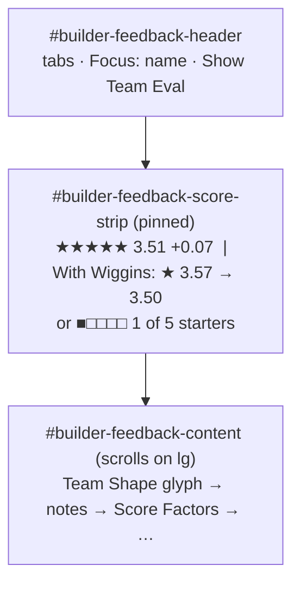

# Walkthrough — #142: the score strip

> Issue: [#142 Build: pin a score strip above the Team Shape](https://github.com/chrooks/Cornerstone/issues/142)
> Commits: `4debccc` (strip) · `1c20822` (wrap fix, spec) · `develop` · proven on dev 2026-09-26

## What was wrong

The star badge, its delta chip, and the hover preview all rendered under the Team Shape glyph inside the panel's scroll area. With a full Rotation the glyph filled the viewport and the 3.51 sat below the fold (desktop-09). The hover preview, the whole point of feedforward, sat there too (desktop-46).

## What changed

The three pieces moved up, out of the scroll container. The glyph did not move.



In [BuilderFeedbackPanel.tsx](../../frontend/components/builder/BuilderFeedbackPanel.tsx) the shell mounts `FeedbackScoreStrip` between the header and `#builder-feedback-content`, only on the Feedback tab. On `lg` the content div is the scroll container, so anything above it is pinned by construction. No `sticky`, no z-index.

```tsx
{activeTab === "feedback" && (
  <FeedbackScoreStrip allSlots={allSlots} latestEval={latestEval} evalPreview={evalPreview}
    isEvaluating={isEvaluating} inspectedPlayer={inspectedPlayer} inspectionSource={inspectionSource} />
)}
```

The strip reuses `AnimatedScoreCaption` (the #88 roll and flash) and `StarterProgressCaption` (#149). They lost their own `mt-2` and centring; the strip lays them out. The #92 preview block moved with its ids intact, so the existing hover spec's selectors still resolve.

The #92 gate ("only while the hover it was computed for is live, never while the committed eval is catching up") was inlined in the read. It is now `resolveActivePreview()`, called by the strip and the read. One home for one rule.

Below `lg` the panel does not scroll on its own, so the strip is not pinned there. #141 puts the strip in the phone tab bar, which is the right home for it.

## Proof

[lab-build-fixes.spec.ts](../../frontend/tests/lab-build-fixes.spec.ts), 6 passed on `https://cornerstone-dev.hestia.chrooks.com`. The #142 cases build an 8-of-9 Rotation from the API (Legend plus the seven cheapest priced actives, so one slot stays open and rows remain hoverable), then assert: the strip is fully in the viewport, the strip's top is above the glyph's, no score badge remains inside the scrolled read, and on desktop a hover puts "★ n.nn → n.nn" in the strip.

| | before | after |
|---|---|---|
| desktop | [strip](https://github.com/chrooks/Cornerstone/blob/develop/docs/research/lab-fix-screens-2026-09/142-build-score-strip-desktop-before.png) · [hover](https://github.com/chrooks/Cornerstone/blob/develop/docs/research/lab-fix-screens-2026-09/142-build-hover-preview-desktop-before.png) | [strip](https://github.com/chrooks/Cornerstone/blob/develop/docs/research/lab-fix-screens-2026-09/142-build-score-strip-desktop-after.png) · [hover](https://github.com/chrooks/Cornerstone/blob/develop/docs/research/lab-fix-screens-2026-09/142-build-hover-preview-desktop-after.png) |
| phone | [strip](https://github.com/chrooks/Cornerstone/blob/develop/docs/research/lab-fix-screens-2026-09/142-build-score-strip-phone-before.png) | [strip](https://github.com/chrooks/Cornerstone/blob/develop/docs/research/lab-fix-screens-2026-09/142-build-score-strip-phone-after.png) |

`eval-preview.spec.ts` fails on dev for a reason outside this change: its hard-coded roster prices at $201M of Value under the $195M cap, so no picker row is affordable. Logged on [#123](https://github.com/chrooks/Cornerstone/issues/123).
