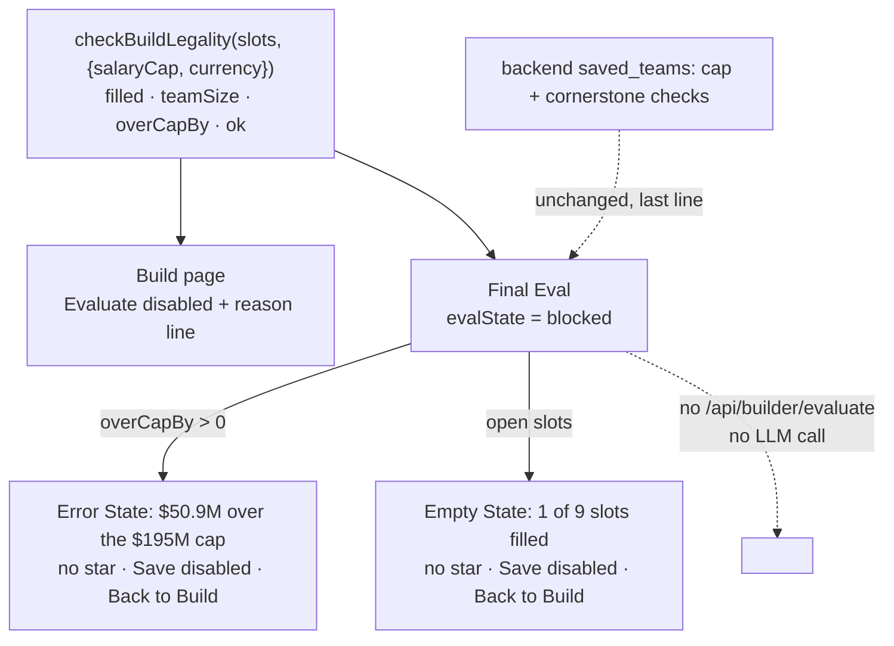

# Walkthrough — #143: Builds the RuleSet forbids

> Issue: [#143 Block Builds the RuleSet forbids (over cap, incomplete) from Evaluate and Save](https://github.com/chrooks/Cornerstone/issues/143)
> Commit: `c201cb0` on `develop` · proven on dev 2026-09-26 at 1440x900 and 390x844

## What was wrong

The Build page only checked "all slots filled" before Evaluate. The Final Eval checked nothing: it rebuilt the roster from the URL, called the engine in final mode (an LLM call), and showed a star. The audit had an over-cap Build scoring 3.57 against a legal 3.51 (desktop-28), and a Legend-only Build scoring 0.00 (phone-09f). Only the backend save check stood between an illegal Build and a saved Team, and it spoke after the login redirect.

## What changed

One check, two Surfaces.



[buildLegality.ts](../../frontend/components/builder/buildLegality.ts) is the check. It prices each slot through `getPlayerPrice` under the RuleSet currency, the same arithmetic the salary gauge uses, so the reason on the page and the gauge never disagree. `describeBuildBlock` orders the reasons: the cap first, because it is the rule; open slots second, because that is progress.

```ts
if (legality.overCapBy > 0 && legality.salaryCap != null) {
  return `${formatSalaryM(legality.overCapBy)} over the ${formatSalaryM(legality.salaryCap)} cap`;
}
if (!legality.complete) {
  const open = legality.teamSize - legality.filled;
  return `${open} open slot${open === 1 ? "" : "s"} — fill the ${teamLabel} to evaluate`;
}
```

**Build page.** [BuilderHeader.tsx](../../frontend/components/builder/BuilderHeader.tsx) takes `evaluateBlockReason` instead of a boolean. The disabled button gets the reason as its tooltip and `aria-describedby`, and a mono line under it says the same thing, red for the cap. Transparent Friction: the button says no and says why in the RuleSet's own units.

**Final Eval.** [EvaluatePage.tsx](../../frontend/components/builder/EvaluatePage.tsx) gains a fifth state, `blocked`. Phase 1 (load players and RuleSet) runs the check right after it rebuilds the slots. If the Build is illegal it sets `blocked` and `evalState = "blocked"`, and phase 2 (the engine call) returns early. No request leaves the page. The Rotation summary still renders, so you can see what you brought. Save stays disabled through the existing `evalState !== "ready"` rule, with the reason as its tooltip, so a signed-out user is never redirected to log in for a Team the RuleSet will refuse.

## Proof

[lab-build-fixes.spec.ts](../../frontend/tests/lab-build-fixes.spec.ts), 9 passed on `https://cornerstone-dev.hestia.chrooks.com`. The #143 case: Legend plus the eight dearest actives ($308.7M over on dev today) → Evaluate `aria-disabled` with a dollar reason; the Final Eval shows `#eval-over-cap`, no `#cohesion-score-rating`, Save disabled, and zero `/api/builder/evaluate` requests from that page; a Legend-only Rotation shows `#eval-incomplete` reading "1 of 9 slots filled", and Back to Build lands on the Build. [build-legality-logic.spec.ts](../../frontend/tests/build-legality-logic.spec.ts), 4 passed.

| | before | after |
|---|---|---|
| Build over cap | [desktop](https://github.com/chrooks/Cornerstone/blob/develop/docs/research/lab-fix-screens-2026-09/143-build-over-cap-desktop-before.png) | [desktop](https://github.com/chrooks/Cornerstone/blob/develop/docs/research/lab-fix-screens-2026-09/143-build-over-cap-desktop-after.png) |
| Final Eval over cap | [desktop](https://github.com/chrooks/Cornerstone/blob/develop/docs/research/lab-fix-screens-2026-09/143-eval-over-cap-desktop-before.png) | [desktop](https://github.com/chrooks/Cornerstone/blob/develop/docs/research/lab-fix-screens-2026-09/143-eval-over-cap-desktop-after.png) |
| Final Eval incomplete | [phone](https://github.com/chrooks/Cornerstone/blob/develop/docs/research/lab-fix-screens-2026-09/143-eval-incomplete-phone-before.png) | [phone](https://github.com/chrooks/Cornerstone/blob/develop/docs/research/lab-fix-screens-2026-09/143-eval-incomplete-phone-after.png) |

Not touched: the free-for-all RuleSet has no cap, so only completeness gates it. The backend cap check is unchanged.
