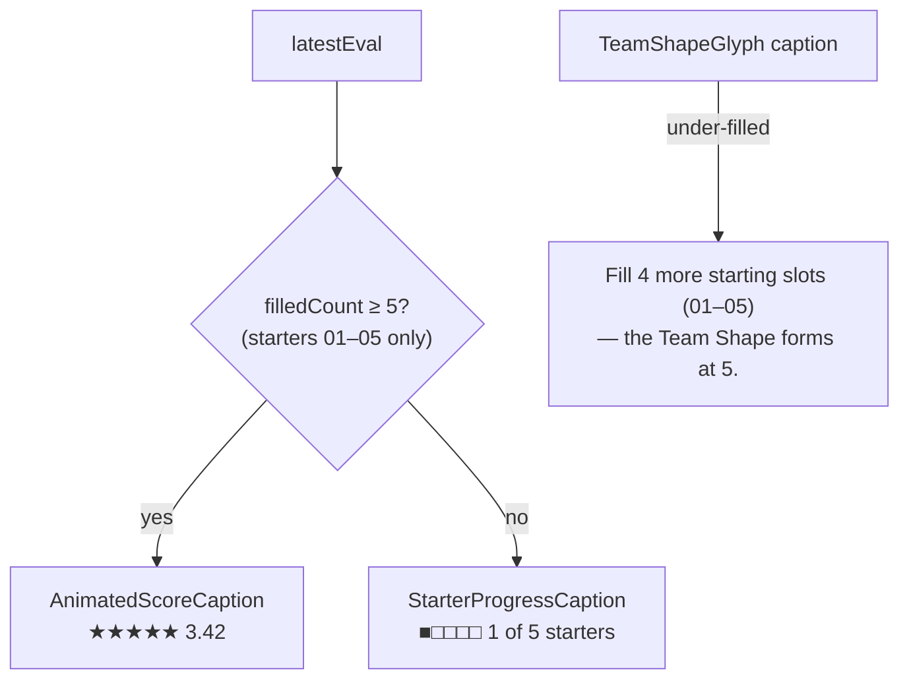

# Walkthrough — #149: starter progress instead of 0.00 stars

> Issue: [#149 Build: replace the 0.00 stars with starter progress](https://github.com/chrooks/Cornerstone/issues/149)
> Commit: `a66f272` on `develop` · proven on dev 2026-09-26 at 1440x900 and 390x844

## What was wrong

The feedback panel rendered the star badge as soon as the engine returned anything, and with one starter the engine returns 0.00. A bench-first user read a zero as a verdict. The Team Shape caption said "Add 4 more Players", which four bench picks satisfy without a shape forming.

## What changed



[BuilderFeedbackPanel.tsx](../../frontend/components/builder/BuilderFeedbackPanel.tsx):

```tsx
{latestEval && (filledCount >= 5
  ? <AnimatedScoreCaption score={latestEval.star_rating} />
  : <StarterProgressCaption filledCount={filledCount} />)}
```

`filledCount` already counted starters only (`allSlots.slice(0, 5)`). The new caption uses five squares, not five stars. Stars mean a score, and filling them with a slot count would be a dishonest Signifier. The squares are the same sharp geometry as the slot cards above.

[TeamShapeGlyph.tsx](../../frontend/components/builder/TeamShapeGlyph.tsx) keeps one message and makes it exact: "Fill N more starting slot(s) (01–05) — the Team Shape forms at 5." The count lives in one place, the slot hint in the other, so the two lines do not repeat each other.

## Proof

[lab-build-fixes.spec.ts](../../frontend/tests/lab-build-fixes.spec.ts) on `https://cornerstone-dev.hestia.chrooks.com` with one starter picked: "1 of 5 starters" present, no `#builder-new-feedback-score`, caption names slots 01–05. Both widths.

| before | after |
|---|---|
| [desktop](https://github.com/chrooks/Cornerstone/blob/develop/docs/research/lab-fix-screens-2026-09/149-build-feedback-desktop-before.png) | [desktop](https://github.com/chrooks/Cornerstone/blob/develop/docs/research/lab-fix-screens-2026-09/149-build-feedback-desktop-after.png) |
| [phone](https://github.com/chrooks/Cornerstone/blob/develop/docs/research/lab-fix-screens-2026-09/149-build-feedback-phone-before.png) | [phone](https://github.com/chrooks/Cornerstone/blob/develop/docs/research/lab-fix-screens-2026-09/149-build-feedback-phone-after.png) |
