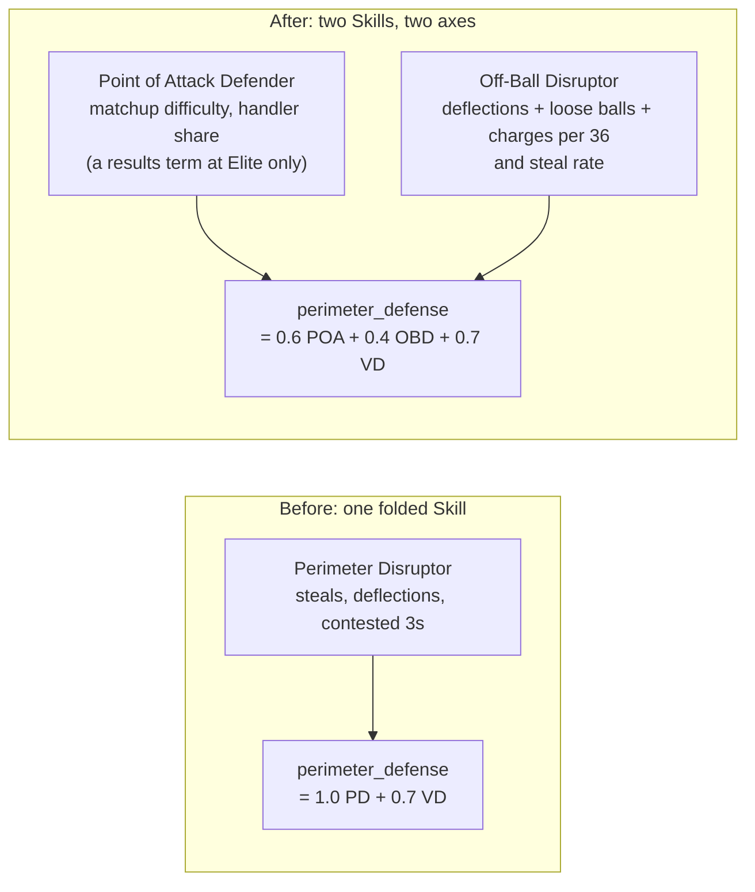
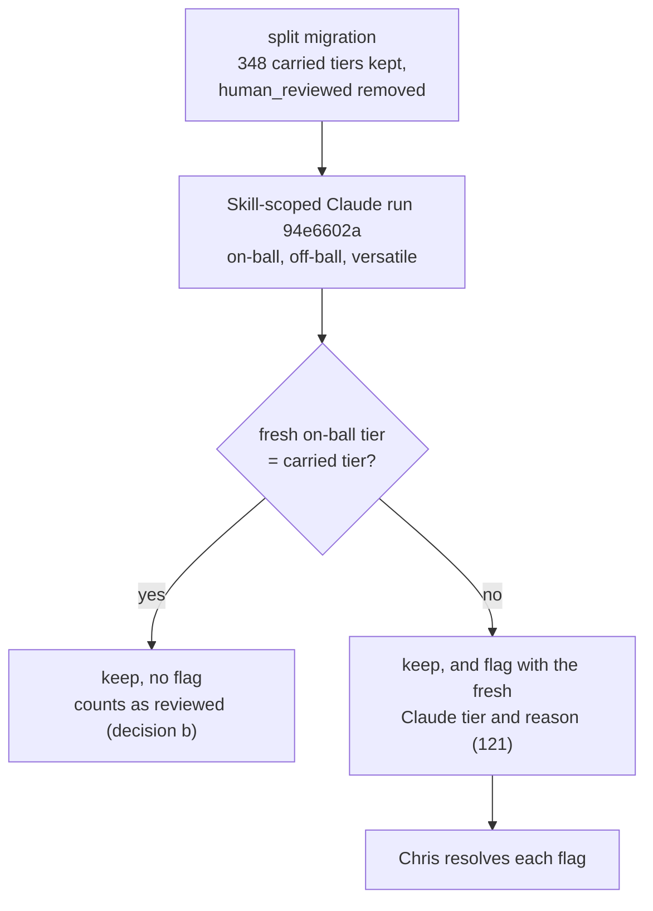

# Walkthrough — #152: Perimeter Disruptor splits into an on-ball and an off-ball Skill

> Issue: [#152 Split Perimeter Disruptor into on-ball and off-ball defensive Skills (before V1)](https://github.com/chrooks/Cornerstone/issues/152)
> Commits: `d2f7546` (per-Skill bulk review) · `470481b` (Skill-scoped Claude run) · `e5373a3` (the split) · `1780c96` (split parity proof) · `7f67448` (wider Off-Ball Disruptor definition) on `develop`
> Evaluation Version: **EV v10 `cohesion-v10-perimeter-split`, id `98fbdf7a-877f-4d8d-a184-05353c31c774`**, published on dev 2026-09-22 22:59Z. Active now: `cohesion-v11-legend-clip` (`cc244038-7563-4d22-a6f0-b327924aca78`), which keeps the v10 split coefficients.
> Shipped in releases `2025-26 V1 (#119 #130 #134 #152 #168)` (`66d4600c`) and `2025-26 V1.1 (#181 drift fix)` (`020cbc9e`, active), both 2026-09-25.
> Found in the #119 grill (2026-09-21). OG Anunoby ranked 74th-75th against The Ringer's 21st. Research showed that the folded Skill mixed two different things: whom a player guards, and what he takes away from other players. Chris: "I'd rather have it right than have it on time."

## The problem in one picture

One Skill held two axes. On 2025-26 data the two axes correlate only 0.41 among perimeter players, so one tier could not describe both. The old stat rule read steals, deflections and contested threes, which is mostly off-ball activity. It could not see a stopper who takes the toughest assignment.



VD is Versatile Defender. The two new coefficients sum to the old Perimeter Disruptor weight of 1.0.

## The fix

### 1. Two keys, one rename — `backend/services/skills.py` and migration `20260923000000`

The on-ball half takes back its old key, `point_of_attack_defender`. The off-ball half is new: `off_ball_disruptor`. Both are LOW confidence, so Claude rates them informed and a disagreement goes to review.

```python
LOW_CONFIDENCE_SKILLS: frozenset[str] = frozenset({
    "versatile_defender",
    "point_of_attack_defender",
    "off_ball_disruptor",
    "high_flyer",
})
```

The migration moves every `perimeter_disruptor` entry to the on-ball key. An on-ball entry that is already there wins. It also removes the "Chris reviewed this" marker from each carried entry, because the old Skill meant more than the new one:

```sql
UPDATE draft_skill_profiles
SET profile = jsonb_build_object(
      'point_of_attack_defender',
      CASE WHEN jsonb_typeof(profile -> 'perimeter_disruptor') = 'object'
           THEN (profile -> 'perimeter_disruptor') - 'human_reviewed'
           ELSE profile -> 'perimeter_disruptor' END
    ) || (profile - 'perimeter_disruptor')
WHERE profile ? 'perimeter_disruptor';
```

Published releases are immutable, so the migration leaves them alone. A small alias shim, `with_legacy_skill_keys`, lets a pre-split release score exactly as before and show its old tier under the new name.

### 2. The engine math — `backend/services/cohesion_engine/composites.py`

```python
if "off_ball_disruptor" in present_keys:
    raw_perimeter_defense = (
        c.get("perimeter_defense_poa", 1.0) * _tv("point_of_attack_defender")
        + c.get("perimeter_defense_off_ball", 0.0) * _tv("off_ball_disruptor")
        + c["perimeter_defense_versatile_defender"] * _tv("versatile_defender")
    )
else:
    raw_perimeter_defense = (
        _tv("point_of_attack_defender")
        + c["perimeter_defense_versatile_defender"] * _tv("versatile_defender")
    )
```

A player without an off-ball rating scores exactly as he did before the split. The declarative formula in EV v10 has the same fallback (`when_missing: ["off_ball_disruptor"]`). `publish_perimeter_split_ev.py` published EV v10 with `perimeter_defense_poa: 0.6` and `perimeter_defense_off_ball: 0.4`.

### 3. Two stat rules, each on its own axis

Chris approved both rule bodies as drafted on 2026-09-23 (drift tables on #152: [on-ball](https://github.com/chrooks/Cornerstone/issues/152#issuecomment-5786041320), [off-ball](https://github.com/chrooks/Cornerstone/issues/152#issuecomment-5786041605)).

| Skill | Capable | Proficient | Elite |
|---|---|---|---|
| Point of Attack Defender | difficulty ≥ .62, handler share ≥ .115 | ≥ .655, ≥ .135 | ≥ .69, ≥ .19, and opponents shoot ≥ 1 point worse (`cross_group_fg_pct_diff ≤ -0.010`) |
| Off-Ball Disruptor | events/36 ≥ 3.25, steal % ≥ 1.4 | ≥ 4.5, ≥ 2.2 | ≥ 5.9, ≥ 2.8, 50+ games |

- The on-ball rule reads deployment: the average scoring percentile of the players he guards, and the share of his time spent on ball handlers. These come from the #134 matchup fetch fix.
- The off-ball rule reads events per 36 minutes (deflections, loose balls, charges) and steal rate. Every tier needs both.
- All 12 Point of Attack award anchors clear Proficient. All 9 Hands anchors clear.
- The two rules correlate at a Spearman of 0.192. The skeptic's bar was below 0.77, the figure for the old folded rule.

### 4. No human decision lost — the Skill-scoped Claude run and decision (b)

Before this work, a Claude run rewrote whole profiles and erased every human decision. `470481b` added a run that asks Claude only about chosen Skills and keeps each human decision word for word. When the fresh tier disagrees with the decision, the run stages a flag that carries Claude's fresh tier and reason (`backend/services/skill_engine/evaluation_only.py`):

```python
elif fresh_entry is not None:
    ...
    flag_claude_tier = fresh_entry.get("tier")
    flag_justification = fresh_entry.get("justification")
```

Decision (b) in the #119 plan sets how the 348 carried decisions get their review. Chris approved it on 2026-09-21.



A carried None does not count toward a negative label (Cone, Defensive target) until Chris resolves it one by one. `d2f7546` added per-Skill bulk review with an "agreements only" mode, so Chris could close the plain agreements in one click and judge the rest one at a time.

### 5. The wider Off-Ball Disruptor definition (2026-09-25) — `7f67448`

During the Legend pass Chris said that off-ball disruption is also position and help defense, not only events. A smart team defender without big steal numbers must still rate. The definition that Claude reads changed in `skills.py`, `frontend/lib/skills.ts` and two docs:

```diff
- "Makes plays away from his own man by jumping passing lanes, digging at drivers and recovering, which creates deflections, steals and charges."
+ "Disrupts the offense away from his own man: holds the right help position, rotates and recovers on the perimeter, digs at drivers and jumps passing lanes, creating deflections, steals and charges."
```

The stat rule did not change. Only Claude's reading changed. Then two things happened:

- **Legends.** Round 2 of the Legend pass asked Claude again about the off-ball key only. Chris set the final tiers (for example Kidd, Wade and Bird at Elite).
- **Players.** Run `83c1b0d7` asked Claude again about the off-ball key for all 392 rated players. It changed 90 Claude opinions (59 new, 25 promotions, 6 demotions) and 0 composite tiers. Every off-ball composite tier was already a human decision, so the guard kept all 359 that the run evaluated. It staged 18 flags where the fresh opinion disagreed with Chris's call. Chris committed the run at 15:27Z and resolved all 18 (17 Trust Claude, 1 override).

## Proof

Re-verified read-only on the dev database and the dev Surface, 2026-09-25 16:35-16:45Z.

| Check | Result |
|---|---|
| Active release `020cbc9e` | 437 rows (401 actives, 36 Legends); **437 carry both new keys**; 0 carry `perimeter_disruptor` |
| Draft profiles (all sources) | 1,261; 0 carry `perimeter_disruptor` |
| On-ball composite entries | 401 of 401 are human decisions (371 resolved, 30 manual override) |
| Off-ball composite entries | 401 of 401 are human decisions (394 resolved, 7 manual override) |
| Legends | 36 of 36 carry both keys. Off-ball: 2 All-Time Great, 18 Elite, 6 Proficient, 7 Capable, 3 None |
| Open flags · `dev_checks damage` | 0 · 0 |
| `audit_tier_drift.py` | 1 drifted tier: DeMar DeRozan `spot_up_shooter`, the known auto-promotion quirk on #176; Chris ruled None correct |
| Active EV | `cohesion-v11-legend-clip`, coefficients POA 0.6 / OBD 0.4 / VD 0.7, fallback POA 1.0 / VD 0.7 |
| Run `83c1b0d7` diff | 90 Claude changes, all on `off_ball_disruptor`; composites: 0 changed, 359 unchanged; no other Skill |

**No human decision lost (ac42).** From the M5.8 run `94e6602a` (plan record): all 348 carried on-ball entries kept their tiers. The run flagged the 121 it disagreed with, each with the fresh Claude tier and reason. Re-checked today: 121 on-ball contradiction flags on record, 121 with a Claude tier, 121 with a reason, 0 open. Of today's 401 on-ball entries, 170 carry Chris's one-by-one mark. 216 hold a carried tier that the fresh check agreed with and that never raised a flag. These count as reviewed under decision (b).

**At the split (2026-09-22, `1780c96`).** Scores did not move: OG `perimeter_defense` 7.3 → 7.3, Holiday 7.5 → 7.5, Gobert 4.1 → 4.1, and every carried tier stayed in place.

**Surface (ac26).** Headless on https://cornerstone-dev.hestia.chrooks.com, today: `perimeter-split.spec.ts` — OG's Profile, the Build picker's Skill columns and the legend editor (test login) show "Point of Attack Defender" and "Off-Ball Disruptor" and never "Perimeter Disruptor". **3 passed.** The split parity and alias tests (`test_legacy_skill_keys.py`, `TestPerimeterDefenseSplitParity`): 41 passed.

**Ringer fit (#108) and concentration (#111), re-run after publish** on release `020cbc9e` with EV v11:

| | Before the split (EV v10, pre-split release) | After publish, legend clip on (live) | After publish, clip off |
|---|---|---|---|
| OG Anunoby (band 6-36) | 75 | **65** | 76 |
| Scottie Barnes (2-32) | 11 | 8 | 13 |
| Evan Mobley (9-39) | 50 | 22 | 22 |
| Ringer top 10 inside our top 15 | 10/10 | 8/10 | 10/10 |
| Spearman (100) · within ±15 | 0.760 · 43 | 0.726 · 43 | 0.736 · 45 |
| API parity | 12 tie-order mismatches (known then, explained on #119) | ok (100 of 100) | skipped (patch) |

- Price check C: 6 of the 12 gated 3-and-D players price below 0.80 of their Ringer-rank price (McDaniels 0.355, Caruso 0.355, Bridges 0.390, White 0.404, OG 0.582, Brooks 0.633).
- Concentration (`--seed 0`): the most-picked active appears in 36% of the top 50 rosters (Derrick Jones Jr.), under the 40% bar. LeBron James (a Legend) appears in 72%. OG appears in 2%.
- The #119 pass line fails (OG misses his band): [verdict on #119](https://github.com/chrooks/Cornerstone/issues/119#issuecomment-5835885288), branch 2. #152 asks that the fit be re-checked after publish, not that it pass. This table is that re-check.
- The split and the reviews did not lift OG by themselves. With the clip off he ranks 76, against 75 before. Mobley moved from 50 to 22.

Files: `.tasks/119-3d-archetypes/ringer-fit-m5.json`, `ringer-fit-m5-noclip.json`, `concentration-m5.txt` (local).

## Found along the way

- **The Trust-button bug.** It was found while writing the #152 review notes, filed as #165, and fixed before Chris's review. See `165-trust-labels-name-the-write.md`.
- **The most-picked active is a known on-ball outlier.** Derrick Jones Jr. tops the concentration table at 36%. The on-ball drift table named him the one "assigned but not good" case that stays Elite. His released on-ball tier is Elite, a resolved call. He is under the bar, but he is the first name to watch if the bar is ever missed.
- **The EV label text is stale (parked).** EV v10 and v11 store the old off-ball wording as the Skill's `label`. Nothing shows it today. But the saved-team compat check (`_diff_footprints` in `backend/services/evaluation_versions/compat.py`) treats a label change as a rename. So a later EV that takes its labels from `skills.py` would show saved teams the compat dialog for a wording change only.
