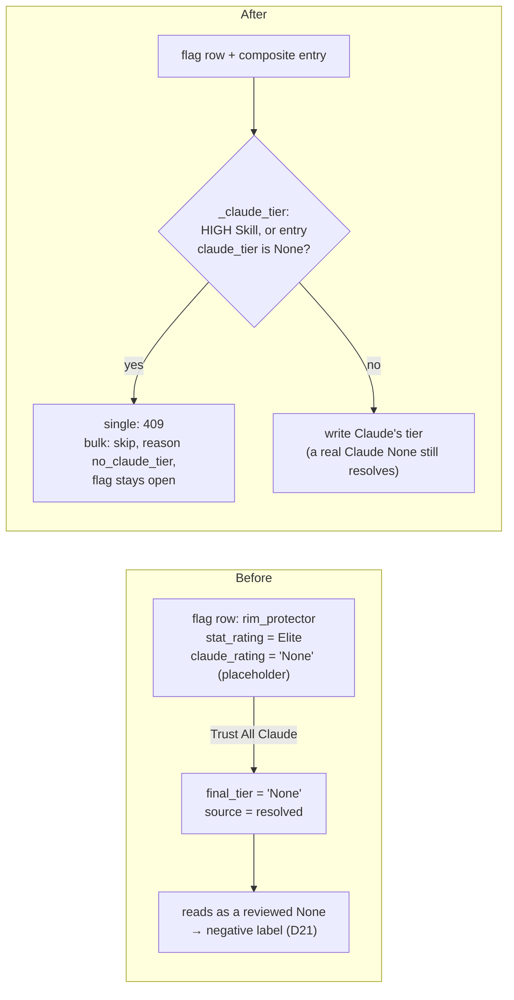
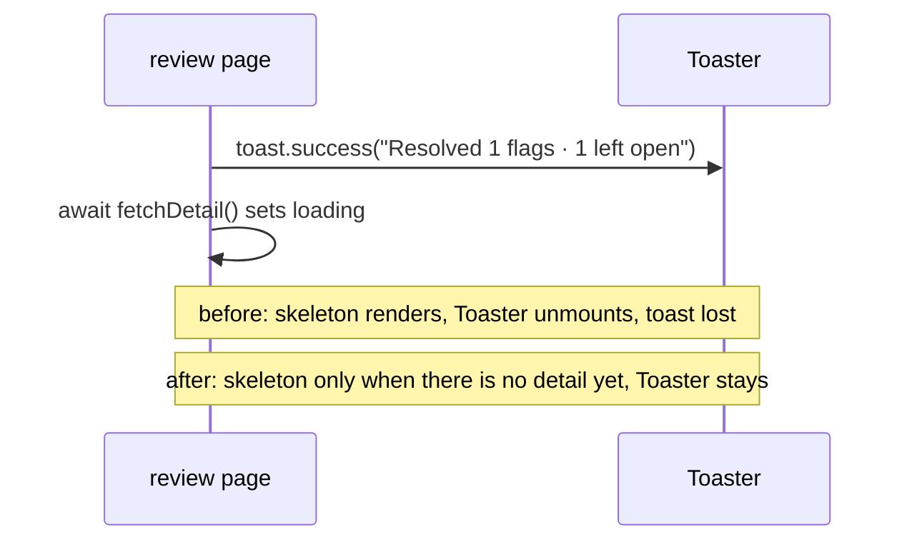

# Walkthrough — #154: "Trust All Claude" no longer writes a false None

> Issue: [#154 "Trust All Claude" bulk resolve nulls stats-only Skill tiers](https://github.com/chrooks/Cornerstone/issues/154)
> Commits: `3939010` (server guard, button, toast) · `d725c4f` (the toast survives the refetch) on `develop`, pushed 2026-09-22 (#119 plan M1.27)
> Found by the #119 grill skeptic on 2026-09-21. The #130 recompute was about to stage about 270 flags on the 7 HIGH Skills, and #152 makes archetype labels read reviewed tiers.

## The bug in one picture

The issue said the bulk path wrote a null. The plan-stage code map found it was worse. `draft_skill_flags.claude_rating` is `NOT NULL`, and the commit RPC stores `COALESCE(claude_tier, 'None')`. So a HIGH Skill (Claude is never asked) or a failed Claude call leaves the **string** `'None'` on the flag. Trusting that string wrote a "reviewed None" over a real stats tier. Decision D21 lets a reviewed None drive a negative label.



## The fix

### 1. One rule for "does Claude have a tier?" — `backend/api/review.py`

The answer comes from the Skill's confidence bucket and the composite entry, not from the flag's string. A missing or malformed entry fails closed.

```python
def _claude_tier(skill_name: str, flag: dict, profile_data: dict) -> str | None:
    if skill_name in HIGH_CONFIDENCE_SKILLS:
        return None
    entry = profile_data.get(skill_name)
    if not isinstance(entry, dict) or entry.get("claude_tier") is None:
        return None
    return flag.get("claude_rating")
```

### 2. Every Trust Claude path uses it

The single resolve refuses:

```python
elif resolution == "trust_claude":
    resolved_tier = _claude_tier(skill_name, flag, profile_data)
    if resolved_tier is None:
        # #154: the flag's 'None' is a placeholder, not Claude's tier.
        return _err(
            f"No Claude tier for '{skill_name}' — use Trust Stats or Override",
            status=409,
        )
```

The bulk resolve skips and reports:

```python
resolved_tier = _claude_tier(sname, flag, profile_data)
if resolved_tier is None:
    _skip("no_claude_tier")
    continue
```

The other resolve paths cannot write a null either. Trust Stats writes `stat_rating`, a `NOT NULL` column. Both override paths accept only a value in `_VALID_TIERS`. When a bulk resolves nothing, it skips the profile write too.

### 3. The page says what it leaves open — `frontend/app/admin/review/[player_id]/page.tsx`

`GET /api/review/<id>/flags` stamps each flag with the server's rule, so the button count and the server skip read one authority:

```python
{**f, "has_claude_tier": _claude_tier(f["skill_name"], f, composite) is not None}
```

```tsx
const noClaudeCount = unresolvedFlags.filter((f) => !f.has_claude_tier).length;
// ...
Trust All Claude
{noClaudeCount > 0 && ` (${noClaudeCount} stats-only left open)`}
```

The button is disabled when no open flag has a Claude tier, and its title says why. The toast reads "Resolved N flags · M left open (stats-only, no Claude tier)".

### 4. The toast now survives the refetch — `d725c4f`

The headless proof found a second bug. The page fired the toast, then refetched. The refetch set `loading`, the page swapped to its skeleton, and the skeleton has no `<Toaster>`. Sonner lost the toast before it painted.



```tsx
// Skeleton on first load only: a refetch after a resolve keeps the page, and
// the <Toaster> in it, mounted — unmounting it drops the pending toast.
if (loading && !detail) {
```

## Proof

Re-verified on 2026-09-25, read-only on the dev database:

| Check | Result |
|---|---|
| ac12 — `python -m pytest tests/ -q -k "resolve or bulk or trust"` (backend) | **85 passed**, 1,187 deselected |
| `tests/test_review_resolve_api.py` | 46 passed; 10 cover the #154 rule (mixed HIGH + LOW bulk, failed Claude call, single 409, a real Claude None resolves, a missing entry fails closed, an all-skipped bulk writes no profile, `has_claude_tier` on the flags, the deck card) |
| Mutation check — `_claude_tier` swapped in memory for the old rule (trust the flag's string) | 4 of 4 guard tests **fail** |
| `dev_checks.py damage` after the publish | **0** damage entries (of 45 resolved-None HIGH entries) |
| Null `final_tier` on dev | 0 of 9,205 composite entries (5,371 resolved); 0 of 10,033 Skill values in the active release |
| Active release (`dev_checks.py release`) | '2025-26 V1.1 (#181 drift fix)', 437 rows (401 actives, 36 Legends) |

From the plan record (not re-run here, to keep this pass read-only):

- **ac24, mocked half** (M1.26, 2026-09-22 18:55Z): `frontend/tests/review-bulk.spec.ts` on https://cornerstone-dev.hestia.chrooks.com, with the real dev admin login and every `/api` call mocked. `1 passed (4.1s)`. It asserts the label "Trust All Claude (1 stats-only left open)" and the toast "Resolved 1 flags · 1 left open". With `d725c4f` reverted on a local dev server, the toast assertion fails the same way.
- **ac24, real data** (M5.10a, 2026-09-23): headless, no click, on Jaime Jaquez Jr.'s review page. He held one open HIGH `isolation_scorer` flag and one Claude-rated `off_ball_disruptor` flag. The button read "Trust All Claude (1 stats-only left open)". `1 passed (3.4s)`.

## Found along the way

- **The issue's premise was half right.** The placeholder is the string `'None'`, not a null (see the first section). The guard keys on "this Skill has no Claude tier", not on `IS NULL`.
- **The manual override had a stale Skill list.** `manual_override_skill` hardcoded `perimeter_disruptor` and missed `steady_hand`. It now reads `ALL_SKILLS` and returns 400 on an unknown Skill (`3939010`).
- **Parked, not filed: the same toast bug on the rulesets page.** `frontend/app/admin/rulesets/page.tsx` toasts "Version published", then reloads, and its `if (loading)` skeleton has no `<Toaster>`. Read from code, not run.
- **Parked, not filed: three read endpoints have no auth.** `GET /api/review/queue`, `GET /api/review/<id>/flags` and `GET /api/pipeline/status`. This was true before #154.
- **New, read from code, not run: the per-player toast names one skip reason.** Since #152 (M2), the per-player Trust All buttons also skip `human_decision` flags, and Trust All Stats skips the defensive keys. The toast still calls every skip "stats-only, no Claude tier". The button counts only flags without a Claude tier, so a Claude-rated human-decision flag is skipped with no count on the button. The per-Skill bar already names each reason. No write risk; the words are wrong.
- **Record note.** The M5.10a drive used a throwaway spec (`tests/zz-m510a.spec.ts`, deleted after the run). Its screenshot was copied to the session scratchpad, not kept in `frontend/test-results/`. The plan's file list says `review-bulk.spec.ts` holds that read; it does not.

## TLDR

"Trust Claude" now writes only a tier Claude gave. A HIGH Skill or a failed Claude call stays open for a person, and the button and toast say how many. After the V1.1 publish, dev holds no damage and no null tiers.
