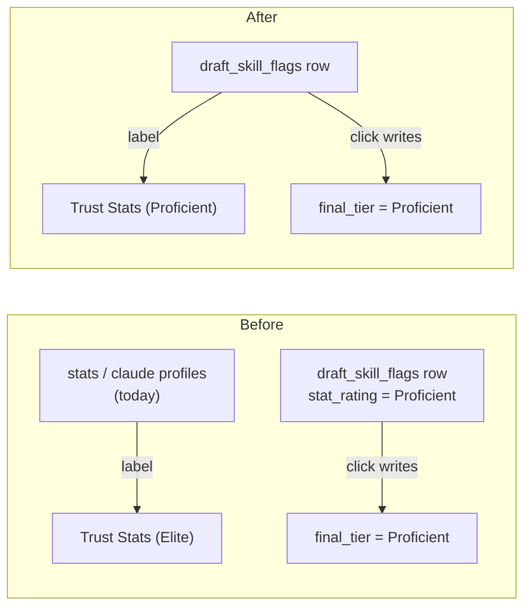
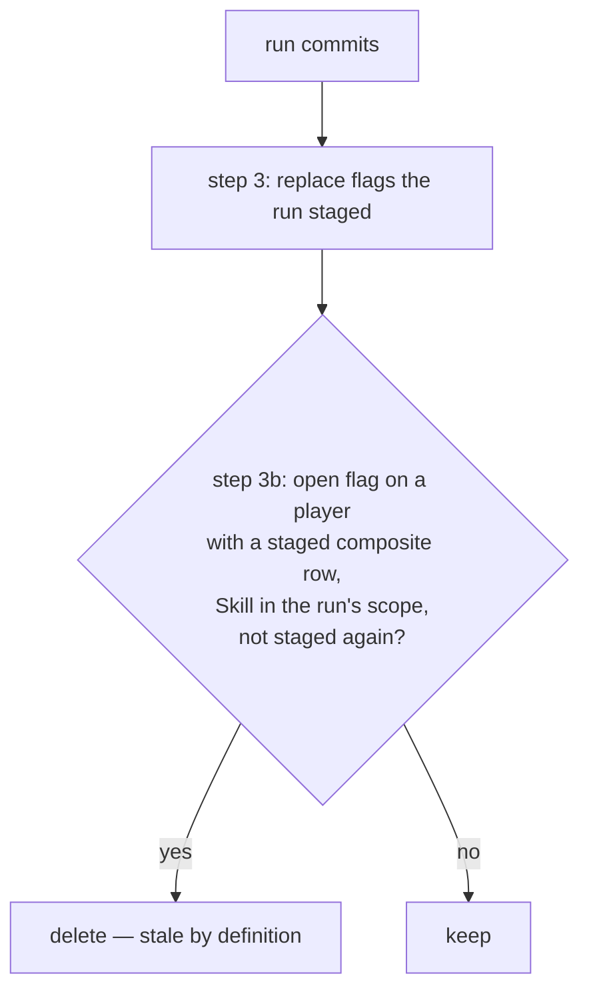

# Walkthrough — #165: Trust buttons name the tier they write

> Issue: [#165 Review flag card: Trust Stats / Trust Claude write a different tier than their label shows](https://github.com/chrooks/Cornerstone/issues/165)
> Commits: `14e883c` (staging) · `93083f7` (commit RPC) · `cdd6081` (review card) on `develop`
> Found while writing the #119 M5.9 review notes; fixed before Chris's M5.11 review session.

## The bug in one picture

The review card had **two authorities** for one decision. The label came from today's profiles; the click wrote the flag row.



On dev the two disagreed on 46 of 1,026 open flags:

- **26 old contradiction flags.** The M5.2/M5.3 stats-only stagings flagged a human decision. The M5.8 Claude run then *agreed* with Chris, so it staged no new flag — and the commit only replaces a flag when a new one is staged. The old flag stayed open with its old tiers. The card showed Chris's own tier on both buttons; either click wrote the old tier over his decision (Alex Caruso: label Elite, write Proficient).
- **20 fresh contradiction flags.** `evaluation_only.py` stored the *recomputed composite* tier in `stat_rating`. The card labelled it as the raw stats tier.

## The three fixes

### 1. The card reads one authority — `frontend/app/admin/review/[player_id]/page.tsx`

```tsx
// #165: one authority. Trust Stats / Trust Claude write the tiers stored on
// the flag row, so the columns and the button labels read the same row.
// Trust Claude shows only when the server would accept it (#154 rule).
const statTier = flag.stat_rating;
const claudeTier = flag.has_claude_tier ? flag.claude_rating : null;
```

The `statTier` / `claudeTier` props (fed from `profiles.stats` / `profiles.claude`) are gone. The four card buttons now carry ids: `#review-flag-<skill>-trust-stats-btn`, `-trust-claude-btn`, `-override-btn`, `-set-override-btn`.

### 2. Contradiction flags store the raw stats tier — `backend/services/skill_engine/evaluation_only.py`

```python
claude_tier=flag_claude_tier,
# #165: the RAW stats tier, as on every other flag. Trust Stats
# writes this value under a "Stats" label; the recomputed
# blend only decides whether to flag.
stats_tier=stat_result.get("tier") or "None",
```

### 3. A commit drops flags the run no longer raises — migration `20260923000001`



Scope comes from the run's params: `skill_name` for a `threshold_edit`, `skill_filter` for a `skill_evaluation` with `recompute_composite`. Any other run touches no flags. Resolved flags are never touched.

## Data repair on dev

One-off, backed up first (all 325 open contradiction rows on the three defensive Skills):

- Deleted the 26 stale flags — but only where fresh Claude equals the human tier, the check that makes "stale" true. Composite entries (the decisions) untouched.
- Set `stat_rating` to the raw stats tier on the 20 fresh flags.

Result: 1,026 → 1,000 open flags; every open flag's `stat_rating` equals the raw stats tier.

## Proof

- Mocked spec on the dev Surface: `review-bulk.spec.ts` 12/12, including the new #165 test (a flag whose row tiers differ from the profiles; labels read the row; a HIGH flag shows no Trust Claude).
- Real page, read only: Spencer Jones's on-ball flag reads "Trust Stats (Proficient)" / "Trust Claude (Capable)" — the flag row.
- Migration: run on the dev DB inside a rolled-back transaction with a synthetic run (stale flag deleted, re-staged flag replaced, out-of-scope Skill and out-of-run player kept); then applied by the deploy.

## TLDR

A Trust button now names the exact tier its click writes, and a run can no longer leave an outdated flag behind. The review notes on #152 no longer need their "do not click" sections.
