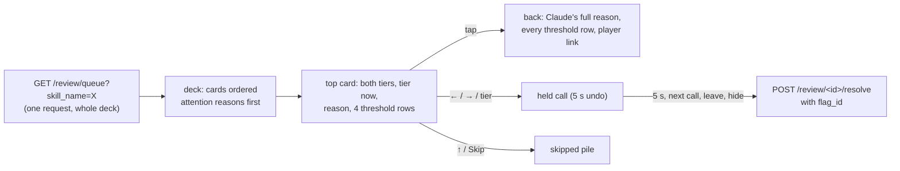
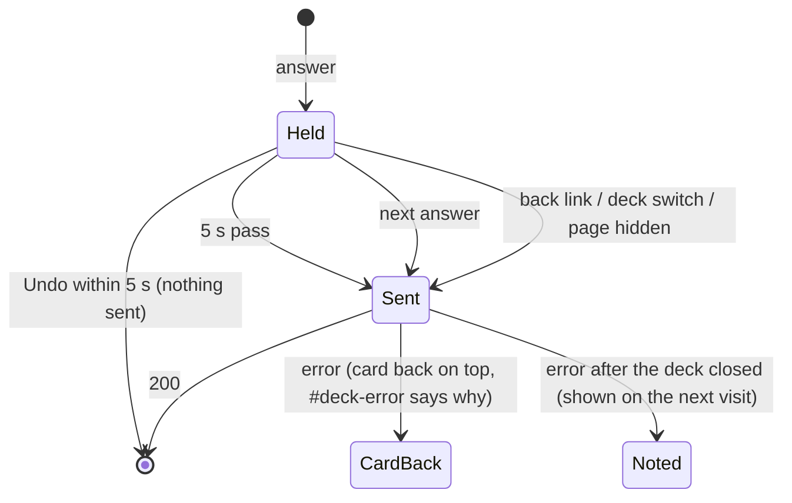

# Walkthrough — #166: a swipe deck for the review queue

> Issue: [#166 Swipe deck for the review queue on a phone](https://github.com/chrooks/Cornerstone/issues/166)
> Surface: `/admin/review/deck?skill=<skill_name>` on `develop` · reached from "Swipe the <Skill> deck" on the review queue
> Why: the M5 review of [#119](https://github.com/chrooks/Cornerstone/issues/119) is about 1,000 open flags, done from a phone, one-handed.

## What it does

One card per open flag on one Skill, across the league. Swipe left to keep the Stats tier, right to keep Claude's, up to skip — or tap one of five tiers to set your own. Every swipe has a button in the bottom panel. Work comes in rounds of 20.



## The data: one request loads a deck — `backend/api/review.py`

With a Skill filter, each queue row is exactly one player with one open flag on that Skill, so a row already is a card. The endpoint already read the flags and composite profiles; it now returns them:

```python
if skill_filter:
    entry["agreement_count"] = flag_info["agreements"]
    entry.update(_deck_card(skill_filter, flag_info["flag"], player, profile_data_by_id))
```

`_deck_card` reads Claude's tier through `_claude_tier`, the same rule the resolve endpoint enforces (#154), so a card never offers a Trust Claude the server would refuse. The unfiltered queue is unchanged.

## Undo without a server undo — `frontend/app/admin/review/deck/page.tsx`

The server cannot reopen a resolved flag: a resolve writes `final_tier`, `human_reviewed` and maybe `reviewed`, and records none of the old values. So undo lives before the write. A call is **held** in the browser:



A closing tab gives JavaScript almost no time, so the held call must reach `fetch()` with no `await` in between — `keepalive` only protects a request once `fetch` has started. The deck reads the login token ahead of time and sends through `resolveFlagNow` in `frontend/lib/api.ts`:

```ts
return fetch(`${API_BASE_URL}/api/review/${playerId}/resolve`, {
  method: "POST",
  keepalive: true,
  headers: requestHeaders(true, accessToken),
  body: JSON.stringify(params),
}).then((res) => readEnvelope(res));
```

## Found in review, fixed before commit

- **One card could take two answers.** The tier strip skipped the 200 ms fly-off guard, and a double tap in reduced motion answered the next card. Now every panel tap passes `dockReady()` — no card leaving, and 250 ms since the last answer (500 ms after a failed save puts a card back). The first answer wins.
- **A swipe could save a tier Chris never saw.** A pipeline commit deletes and re-inserts flags with new tiers. The deck now sends the card's `flag_id`; the server resolves exactly that open flag or answers 409 `flag_changed` and writes nothing. The deck drops the card and offers a reload.
- **Duplicate open flags** on one Skill: the card and the write now both take the lowest id.
- **A round summary could be skipped** after a failed save; rounds are now tracked by number.

## Transparent Friction on the calls that matter

A card whose reason is "Contradicts your call" disputes a tier Chris set by hand. It takes no answer until it has been flipped once, and the tier strip marks his earlier tier "yours".

## Proof

`frontend/tests/review-deck.spec.ts` — real admin login, every `/api` call mocked at 390×844: the deck fits one screen, swipes and buttons send the same writes, the hold is 5 s (`page.clock`: nothing at 4.9 s, the write at 5.1 s), hiding or leaving sends at once, a second answer during the fly-off writes nothing twice, `flag_changed` offers a reload, rounds and Empty States, the queue link. ac14 reads real dev data with every write blocked. A recorded clip (ac13) shows the motion for a person to judge.

Backend: `backend/tests/test_review_resolve_api.py` — the deck card fields, the HIGH-Skill Claude tier, duplicates, `flag_id` pinning and the stale-flag 409.

## Not in this change

- [#161](https://github.com/chrooks/Cornerstone/issues/161): a staged run that commits after a deck session can still overwrite its decisions (the finding is on #161).
- [#167](https://github.com/chrooks/Cornerstone/issues/167): the review read endpoints answer without an admin login.
