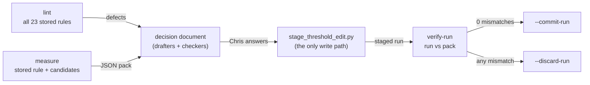

# Walkthrough — #175: the rule lab

> Issue: [#175 Rule lab: one read-only command measures any stat rule and lints all 23](https://github.com/chrooks/Cornerstone/issues/175) (sub-issue of [#168](https://github.com/chrooks/Cornerstone/issues/168))
> Commits: `1754a3e` (lab), `5ad4642` (verify-run hardened after review), `c7ca795` (stages with the #177 history) on `develop`
> Plan record: `.tasks/168-rule-lab/plan.md` (local)

## Why it exists

Each #168 round — Point of Attack, Off-Ball Disruptor, Versatile Defender, Spot Up, Off-Dribble — took a session of hand-written measurement before Chris could decide anything. The machine part was the same every time. `backend/scripts/rule_lab.py` does it once, read-only, for any Skill and any set of candidate rules. Batch 1 (four Skills) then took one workflow instead of four sessions.

## The three commands

- **lint** — every rule's tiers, each bump's reach (DEAD when it cannot act even alone), data-missing players and the null stats behind them, stabilization that never runs, design-doc anchors.
- **measure** — evaluates the stored rule ("today") and each candidate the way a threshold-edit run does (only the edited rule; a full run's auto-promotions reported apart), stages each player through the production `_stage_composite_for_player` with the #177 history, and writes a JSON pack: tiers, the staged entry and flags per player, human-call agreement (All-Time Great is its own tier), moves, gate-passer percentiles (raw, stabilized, per-season), anchors, named players. It also re-stages today's rule and reports **composite drift**: live entries the stored rule does not reproduce.
- **verify-run** — compares a staged run with a measured candidate: every staged entry equal to the simulated one, every flag matched as a multiset, no player missing or extra, no other Skill changed, and the run's rule equal to the measured rule. Exit 1 on any mismatch.

Everything reads through `dev_checks.read_only_client()` (select only; the production project refused) after `block_side_effect_paths()`.

## Proof

- **Regression:** reproduces every number in the verified Off-Dribble decision document (live 7/11/19/355, threes-only 2/10/16/364; flags 27/29/24/27/27; call agreement 4/18, 2/13, 7/21 of 31) and Spot Up 31/65/66/230, with 0 drift field by field.
- **Tests:** `backend/tests/test_rule_lab.py` (10), pure — no database.
- **Live:** verify-run guarded five commits on 2026-09-25 (Offensive Rebounder, Rebounder, Rim Protector, Isolation Scorer, Steady Hand), each 0 mismatches. It also **stopped** a Rim Protector commit: Chris resolved two Off-Dribble flags after staging, and the commit would have overwritten them (#161).

## What it found on the way

- [#176](https://github.com/chrooks/Cornerstone/issues/176): threshold-edit runs skip auto-promotions into the edited Skill and never refresh the stats profile.
- [#177](https://github.com/chrooks/Cornerstone/issues/177): every recompute asked again about calls already kept (fixed).
- [#174](https://github.com/chrooks/Cornerstone/issues/174): drive and post-touch FG% stabilization never runs.
- The code review of the lab itself found three ways verify-run could pass a wrong run; all fixed in `5ad4642` before any live use.

## Known limit

For Claude-rated Skills, `stage()` approximates notability from the stored record (a live notability read would call NBA.com). Measuring the floor retrofit showed composite drift on Driver (77) and Crafty Finisher (15). Before batch 2 (the Moderate Skills), confirm the lab reproduces a real run there, or read the stored notability.
