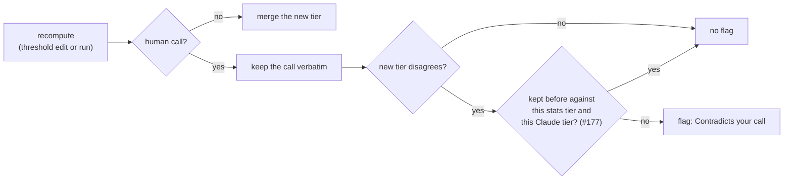

# Walkthrough — #177: a recompute does not ask again about a call you kept

> Issue: [#177 The #120 guard asks again about a call the reviewer kept against the same stats tier](https://github.com/chrooks/Cornerstone/issues/177)
> Commits: `c7ca795` (guard + run history + lab) on `develop`, deployed in `e8d28a1`
> Found by the rule lab ([#175](https://github.com/chrooks/Cornerstone/issues/175)) while measuring #168 batch 1: 14 of Rim Protector's 17 flags were questions Chris had already answered.

## The problem in one picture

The #120 guard keeps a human call verbatim through a recompute and flags it when the new stats tier disagrees. It had no memory, so a call Chris kept against a stats tier came back on the next recompute, and the next.



## The fix

**The run reads the answers once.** `evaluate_skills_for_run` (`backend/services/skill_engine/evaluation_only.py`) reads the resolved flags of the players who hold a human call in the Skills it stages, in one batched, paged query. Each resolved flag already records what the reviewer decided against (`stat_rating`, `claude_rating`) and what they kept (`resolved_value`):

```python
kept.add((owners[f["skill_profile_id"]], f["skill_name"], f["stat_rating"] or "None",
          f.get("claude_rating") or "None", f["resolved_value"]))
```

**The guard skips a matching question.** In `_merge_composite_for_skills`:

```python
already_kept = (player_id, skill_name, stats_tier, flag_claude_tier or "None",
                human_tier) in (kept_calls or ())
if _tier_index(fresh_tier) != _tier_index(human_tier) and not already_kept:
    protected_flags.append(...)
```

Three cases still ask, on purpose:
- the stats tier moved since the answer;
- Claude changed its opinion (the adversarial review added the Claude tier to the match, so a `with_claude` run still shows a new Claude opinion);
- the call changed after the answer (for example Chris overrode it later).

A `data_missing` resolution is not a kept call: its "None" is not a stats verdict.

`kept_calls=None` keeps the old behavior, so every other caller is unchanged. The rule lab and `sim_threshold_candidate.py` stage with the same history, so their flag counts match a real run.

## Proof

| Skill (dev, 2025-26) | flags before | flags after |
|---|---|---|
| Rim Protector, today's rule | 16 | **0** |
| Rim Protector, recommended P | 17 | **3** |
| Isolation Scorer, recommended V | 18 | **13** |
| Offensive Rebounder / Rebounder | 9 / 3 | 9 / 3 (no repeats) |

Live: the deployed server staged Rim Protector P15 (run `e455a6f9`) with exactly the lab's 1 flag. Tests: `backend/tests/test_guard_kept_calls.py` (8 cases, including a mutation check that fails without the guard).

## Found along the way

- The commit RPC's step 3 deletes every earlier flag for a (profile, Skill) pair, resolved ones included, when it commits a new flag for that pair. An answer therefore survives only until a genuinely new question replaces it — which is the behavior #177 wants.
- The dev backend writes no access log, so a "review activity" check must read the `Resolved flag` log line. `verify-run` caught a live #161 race on the same day.
