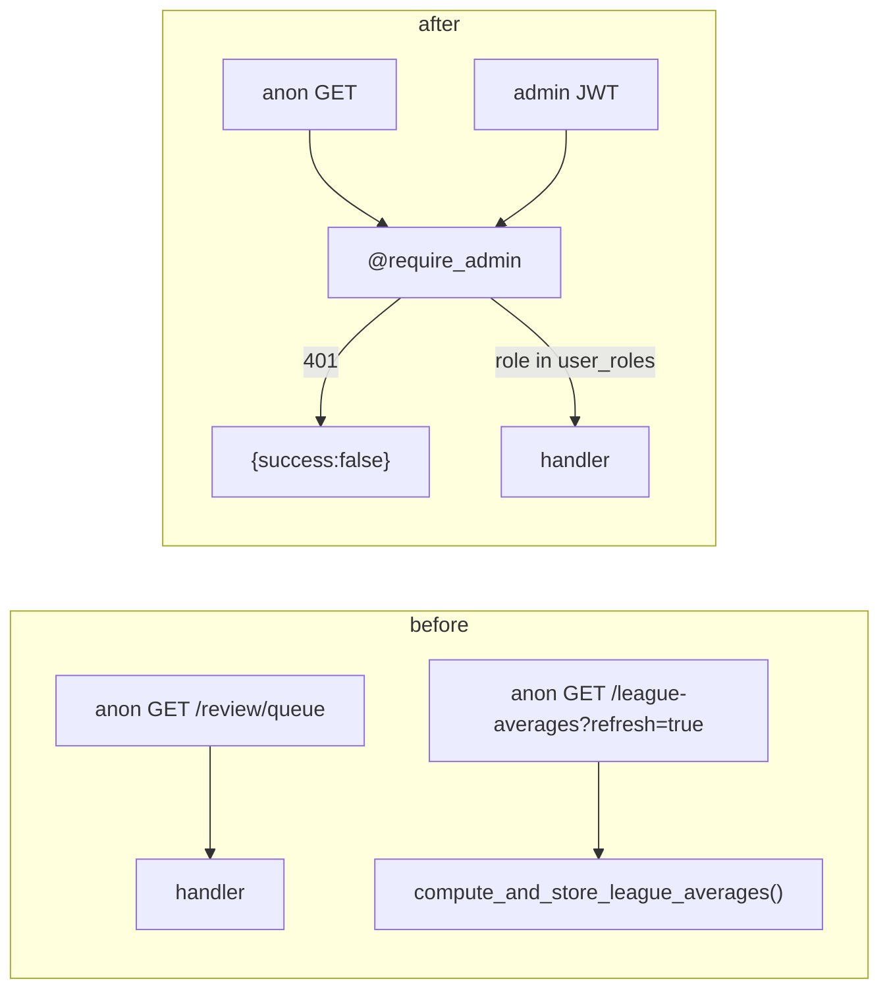

# Walkthrough — #182: admin gate on the five open reads

> Issue: [#182 Admin read endpoints, and a GET that writes, have no auth](https://github.com/chrooks/Cornerstone/issues/182)
> Folded in: [#167 Review read endpoints answer without an admin login](https://github.com/chrooks/Cornerstone/issues/167)
> Commit: `6a7d56e` on `develop` · deployed to dev 2026-09-26

## What was wrong

Five GET routes answered anyone who could reach the backend. Four leaked admin data: every open flag, Claude's reasons, per-condition breakdowns, pipeline counts. The fifth wrote.

`GET /api/league-averages` recomputes and upserts every league average on `?refresh=true`. It also recomputes when the table is empty for the season named in `?season=`. An anonymous caller could name any season and trigger a write. Every stabilized Skill reads those rows.

Dev is LAN/Tailscale only, so nothing was reachable from the internet. Production would have been.



## What changed

Six decorator lines. No frontend change. No new helper.

**The gate** already existed in [auth.py](../../backend/api/auth.py): `require_admin` verifies the Supabase JWT (HS256 via the project secret, or RS256/ES256 via JWKS), then checks `user_roles`. The write routes beside each read already used it. The reads now do too:

```python
@review_bp.route("/review/queue", methods=["GET"])
@require_admin
def review_queue():
```

Same one line on `player_flags`, `skill_breakdown`, `pipeline_status`, and `league_averages`.

**Why the whole league-averages route, not only the write branch.** Only `/admin/calibration` reads it. Gating the full route closes both write paths with one line and no `is_admin_request()` branching. If a public Surface ever needs the averages, split a public read then.

**Why no frontend change.** `apiFetch` in [api.ts](../../frontend/lib/api.ts) attaches the session JWT on every request, GETs included. Every caller of the five routes lives under `/admin`. `getPipelineStatus` has no caller at all.

## How it is proven

[test_admin_read_gates.py](../../backend/tests/test_admin_read_gates.py) parametrizes four cases over the five routes. The tokens are real HS256 JWTs signed with a test secret, so `_verify_jwt` runs for real. Only the `user_roles` lookup is faked.

```python
def _token(sub: str) -> str:
    return jwt.encode(
        {"sub": sub, "aud": "authenticated", "exp": int(time.time()) + 60},
        _SECRET, algorithm="HS256",
    )
```

| Case | Expect |
|---|---|
| no token | 401 |
| valid token, no `user_roles` row | 403 |
| token signed with the wrong secret | 401 |
| admin token | not 401, not 403 |

The admin case asserts "past the gate", not a literal 200. A 200 needs a fake Supabase per handler body, and the gate is the thing under test.

Two existing test files called the gated GETs anonymously and started failing. `test_review_resolve_api.py` now sends its fixture's admin header on the queue GETs. `test_in_chunks.py` gained a small `_as_admin(monkeypatch)` bypass for its two route tests.

**Live on dev**, `https://cornerstone-dev.hestia.chrooks.com`, after the auto-deploy:

| Route | Anonymous |
|---|---|
| `/api/review/queue` | 401 |
| `/api/review/<id>/flags` | 401 |
| `/api/review/<id>/skill-breakdown` | 401 |
| `/api/pipeline/status` | 401 |
| `/api/league-averages?refresh=true` | 401 |
| `/api/health` (control) | 200 |

A forged HS256 token returns 401 `Invalid token`.

Not proven live: the admin screens still loading on dev. No dev admin test login exists. The tests cover that path.

## Full suite

28 failures, identical to the clean-develop no-network baseline. 1247 passed. 20 new.
