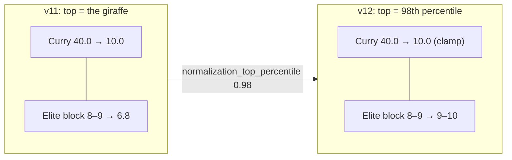

# Walkthrough — #185: pricing the players who do not create shots

> Issue: [#185 `overall` underprices players who do not create shots](https://github.com/chrooks/Cornerstone/issues/185)
> Commits: `a9840c4` (engine key, harness `--groups`, patch file) · `d45050d` (publish script) · `develop`
> Published: Evaluation Version `cohesion-v12-anchor-finishing` on dev, 2026-09-25
> Decision document: [#185 comment](https://github.com/chrooks/Cornerstone/issues/185#issuecomment-5837299901)

## What was wrong

The issue named two mechanisms: the `overall` weights favour creation, and finishing has no route for rim-runners. Measurement found a third that was larger than both.

`_percentile_normalize` scores every axis on a scale whose top is **the single largest raw value in the pool**. One outlier sets the ceiling for everyone. Curry sets `spacing` at 40.0 while the Elite Spot Up block sits at 8–9 and read 6.8. Wembanyama sets `interior_defense` at 20.4 while Gobert's 10.7 read 8.0. Creators sit on multi-Skill axes with no such gap and read 9. So a center with four Elite big-man Skills priced at rank 218, $6.1M.



## What changed

One engine key, two Version settings, one Version publish. No Interface changes.

**The engine key**, [composites.py](../../backend/services/cohesion_engine/composites.py):

```python
def _percentile_normalize(raw, distribution, breakpoint_percentile, breakpoint_score,
                          top_percentile: float = 1.0) -> float:
    ...
    # #185: the scale's top is the raw at rank ceil(n * top_percentile) counting
    # from 1, so 0.98 on 1..100 reads 98.0; 1.0 is the largest raw, as before.
    empirical_max = distribution[max(0, math.ceil(n * top_percentile) - 1)]
```

`normalize_composites` reads `values.get("normalization_top_percentile", 1.0)`. Every past Version carries no key and scores byte-identically. `tune_composite.py`'s copy of the normalizer takes the same line, and a test pins the two together.

**The Version** (`publish_185_anchor_finishing.py`, four idempotent JSON-Patch ops):

| op | what it sets |
|---|---|
| add `normalization_top_percentile` | 0.98 |
| replace `composite_formulas.finishing.factors` | crafty_finisher 1.3, high_flyer 1.0, **vertical_spacer 0.5, pnr_finisher 0.35** |
| add `overall_composite_weights` | today's resolved weights, written explicitly |
| add `overall_mean_peak_blend` | 0.75, written explicitly |

The last two change no score. They make the blob describe itself: an early sweep patched two weights, the shallow merge dropped the other twelve, and Spearman collapsed to 0.14.

**The harness**, `ringer_fit.py --groups`, prints the issue's five groups with each player's price ratio (our price ÷ the ladder price at his Ringer rank) and the decision-2 bar. `scripts/patches/185_anchor_finishing.json` is the recommendation as a `--patch` object, generated from the active Version, so the decision row reproduces from the repository.

## The proof

Ringer harness, unpatched, on the published Version, API parity ok against `https://cornerstone-dev.hestia.chrooks.com`:

| | v11 | v12 |
|---|---|---|
| Ringer top 10 inside our top 15 | 8/10 | **9/10** |
| Spearman over the Ringer 100 | 0.726 | **0.730** |
| within ±15 | 43 | 39 |
| OG Anunoby (band 6–36) | 65 | 80 |

| player | Ringer | v11 rank | v12 rank |
|---|---|---|---|
| Rudy Gobert | 39 | 218 | **133** |
| Jarrett Allen | 58 | 124 | **71** |
| Donovan Clingan | 82 | 200 | **123** |
| Karl-Anthony Towns | 12 | 77 | **52** |
| Jrue Holiday | 74 | 23 | 31 |

| group | mean price ratio | bar |
|---|---|---|
| centers | 0.30 → **0.55** | > 0.50 pass |
| wings | 0.39 → **0.46** | ≥ 0.39 pass |
| stretch bigs | 0.43 → 0.43 | ≥ 0.43 pass |
| 3-and-D | 0.42 → 0.41 | documented miss (#119) |
| overpriced five | 1.70 → 1.45 | |

Stars under v12: SGA 1, Giannis 2, Dončić 3, Wembanyama 4, Curry 5, Jokić 6. Kawhi Leonard at 16 is the one top-10 miss.

Exploit finder, `concentration_harness.py --seed 0`: max active appearance **40%** (Clingan, 20 of 50 top rosters), against 36% (Derrick Jones Jr.) under v11. The #111 rule is "no player over 40%"; the plan's criterion said "under". Clingan and Gobert carry identical big-man Skill sets; under v12 both read 10.0 on both rebounding axes (7.9 before) and 9.2 on interior defense (8.0 before), and Clingan is $0.7M cheaper, so the optimizer leans on him. Chris's call on record in the issue.

`dev_checks.py damage`: 0.

## What it cannot fix

- **3-and-D** (OG 80, band 6–36). OG and Bridges hold the same Elite count; the gap is playoff reputation the ratings cannot see (regular season only, [#164](https://github.com/chrooks/Cornerstone/issues/164)) and height the taxonomy lacks ([#186](https://github.com/chrooks/Cornerstone/issues/186)). Every mechanism that lifted the five together broke the star gate.
- **Markkanen** (111, Ringer 37): same Skill set as Towns on paper; the taller player wins in reality. #186.
- Pair-as-peak (#119 M6.F) is inert on this release: lift 1.00.

## Rollback

`repo.reactivate(<v11 id>)` or `POST /api/evaluation-versions/<id>/reactivate` as admin, then any `develop` push so the caches rebuild. Saved Teams pin their Version and do not move.

## Tests

`tests/test_cohesion_engine/test_composites.py` (anchor at 0.98, default unchanged, `tune_composite` parity), `tests/test_ringer_fit.py` (group rows reuse the ladder quotient), `tests/test_publish_185_anchor_finishing.py` (four ops, idempotence, bad-Skill guard, prod guard). 66 passed. Full-suite failure set identical to clean `develop`.

## TLDR

The top of every axis scale now sits at the 98th percentile, not on one giraffe. Centers and wings price nearer their standing, the stars hold, and one Version carries the whole tune.
